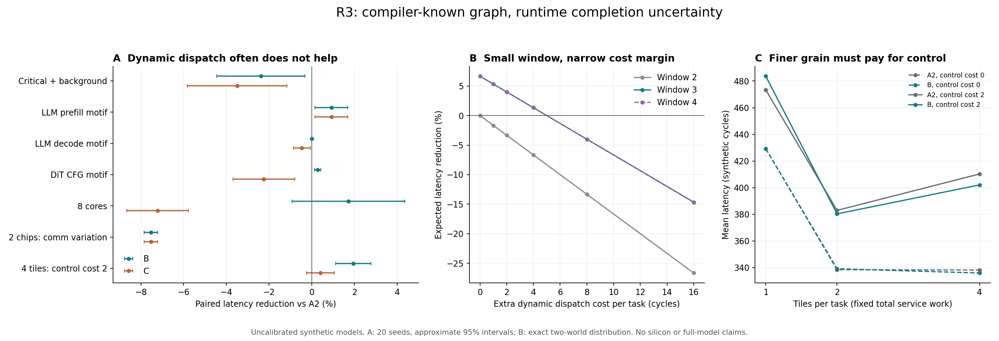

# 多核端侧NPU调度研究

**2026-09-05：R4阶段闭环已完成。** 官方Qwen3.5-4B与FLUX.2-klein-4B已冻结，七种真实来源缩尺图完成数值/状态检查；强化静态对照执行13,440次，另有4,480次priority校正。收费动态尚未达到继续新增硬件的证据门；最佳校正改善约0.197%，区间跨零。详见 [R4阶段报告](r4/experiment_report.md)、[模型登记](r4/model_registry.md)、[独立红队](r4/redteam_report.md) 和 [R4产物地图](r4/README.md)。这仍是缩尺、未校准仿真，未验证完整4B或真实设备性能。

下方保留R3原报告正文。R3当时的README/源码完整副本、旧结果hash已冻结在 [r4/r3_snapshot/](r4/r3_snapshot/manifest.json)，公共sim和R1/R2/R3结果未改。

# R3证伪闭环

日期：2026-09-05。研究主线是静态编译与运行时执行之间的体系结构边界。本目录保留R1/R2原始材料，新增文献审计、第一性原理分析、独立编译契约原型、事件模拟器、实验和反向审计。未访问外部llmSched源码，未复现生产编译器或实际芯片。

**当前判断：动态派发的信息价值确实存在，但“大而全OoO NPU”没有得到本轮结果支持。** 更合适的候选问题是：在编译器已优化映射、地址和偏序之后，用多少有限运行时状态，才能恢复由完成顺序变化造成、且确有替代任务可执行的bubble？这仍是待验证的问题，尚未锁定论文贡献或最终硬件架构。

## 先读这四份

1. [R1/R2完整审计](analysis/r1_r2_audit.md)：七个原始文件的结论、证据、矛盾和可复现反例。
2. [R3实验报告](r3/experiment_report.md)：全部49配置、强静态核对、成本扫描、负结果、验证范围。
3. [文献综述](r3/literature_review.md)与[novelty红队](analysis/novelty_redteam.md)：最接近先例与不能再作为贡献的宽泛说法。
4. [下一轮证据门](r3/next_round.md)：真实图和延迟校准、更强静态、有限总状态、硬件实现、重新核验novelty。

## 本轮最重要的结果

- R2的21个表格点可以复现，但“无地址复用就无收益”“重尾是必要条件”不能推广。无复用、有界CoV0.2的四任务图中，两个固定VPU顺序的最优期望延迟均为150；ready dispatch为140，降低6.667%，并达到这个图的逐场景下界。
- 原R2 toy还存在同刻完成逐事件仲裁偏差：只交换producer编号，220可变成120。新sim在仲裁前批量处理同时刻完成，独立审计与测试覆盖该问题。
- 大图执行了 **49配置×20测试seed×4策略=3,920次**。B对同合同A2的均值改善为10正、17负、22零；这不是统计显著的胜率，更不是真实workload胜率。当前更复杂C没有一个配置的均值超过B，拒绝继续扩张该启发式。
- Prefill motif中B对A2改善0.919%，但另一静态A已经更快，不能用这行证明强静态无法解决。DiT motif改善仅0.281%；两chip通信变化案例反而降低性能7.530%。
- 四任务图中，3项resident窗口取得与4项相同的收益；每task额外动态派发成本8cycle时，动态延迟变成156，反而比静态150慢4%。这是特定图的窗口/成本边界，不能外推成通用硬件配置。
- 泛化的“compiler contract + completion dispatch”有大量先例。LATTICE的2026年v3尤其覆盖静态内存计划作为可验证调度契约；新的贡献必须落到未被覆盖且量化有效的具体硬件机制。



[独立PDF图](r3/figures/r3_evidence.pdf)。图中区间仅描述合成分布的采样误差。

## 对六个起点问题的回答

| 问题 | 当前回答 |
|---|---|
| 哪些runtime uncertainty真实存在？ | 必须区分外生内存/通信服务变化、其他master竞争、数据相关动态工作量，以及调度自身制造的DMA/SRAM/NoC排队。固定shape稠密MXU计算不应无依据随机化。 |
| 是否必然使静态显著偏离最优？ | 不必然。需要完成顺序变化、合法替代任务、可用资源、对最终关键路径有影响，以及可承受控制成本共同成立。精确小图证明存在性，大图与真实设备收益仍需逐例证实。 |
| 哪些LLM/DiT更有希望？ | 优化后仍保留异构engine流水、独立分支、非均匀KV/专家工作量或通信重叠的情况。MoE、GQA/KV、CFG等只是待导出和校准的候选，不能仅凭模型名称判断。 |
| 哪些情况没有价值？ | 可预测且强静态已排满瓶颈的规则计算通常没有机会；即使延迟随机，严格串行链也可能因无替代任务而没有机会。确定性与缺乏调度自由度是不同原因。 |
| 强编译器能消除多少bubble？ | 本轮不能给真实NPU的百分比。fusion、tiling、double buffering、资源约束排程和内存规划可消除已知结构性bubble；必须先做这些优化，再测残差。当前8候选池不是生产级最优。 |
| 无法静态消除的残余是什么？ | 在部署条件下无法预知的release/完成时刻与共享资源状态，以及编译时不可知的工作量变化；但这些残余不一定可由调度恢复。 |

详见[不确定性分析](analysis/runtime_uncertainty.md)、[静态与动态边界](analysis/static_vs_dynamic.md)、[粒度与层级设计空间](analysis/design_space.md)。

## 研究产物地图

| 路径 | 内容 |
|---|---|
| `r1-base/`, `r2-ooo-npu/` | 保留的原始探索材料。 |
| [analysis/](analysis/problem_definition.md) | 问题定义、R1/R2审计、契约要求、不确定性、设计空间、独立模拟器审计。 |
| [literature/](literature/prior_art_registry.md) | foundational与2024–2026工作、工业材料、开源框架、检索原始结果及失败记录。 |
| [工业架构核验](literature/industry_architecture.md) | Jalapeño、scratchpad/cache等材料按confirmed、secondary、inference、speculation分级；尚未核验的专利原始claims不当作实现证据。 |
| [框架选择](literature/frameworks.md) | gem5、Gemmini、SCALE-Sim、Timeloop、Stream、ASTRA-sim/Chakra、BookSim、Ramulator、Accel-Sim、SimGrid、SimPy的适用性。没有为引用框架而假装完成集成。 |
| [sim/README.md](sim/README.md) | workload、compiler、memory、engine、NoC、scheduler、metrics模块及语义。 |
| [experiments/results/r3/](experiments/results/r3/summary.csv) | 全量汇总、逐seed样本、指标、196条示例trace、descriptor与源码manifest。 |
| [r3/hypotheses.md](r3/hypotheses.md) | 各假设的机制、先例、基线、失败条件、实测结果与Keep/Modify/Reject。 |
| [r3/architecture_proposal.md](r3/architecture_proposal.md) | 有条件的最小硬件候选，明确区分已实现与待验证机制。 |
| [r3/rejected_directions.md](r3/rejected_directions.md) | 放弃或降级的说法及原因。 |

## 复现

在目录根执行，仿真仅依赖Python标准库。绘图需要本地已有的matplotlib和numpy。

```powershell
python -X utf8 -B -m unittest discover -s tests -v
python -X utf8 -B -m experiments.run --seeds 20 --training-seeds 8
python -X utf8 -B -m experiments.oracle_probe
python -X utf8 -B -m experiments.check_results
python -X utf8 -B -m experiments.minimum_window
python -X utf8 -B -m experiments.make_report
```

R2独立复现入口：`python -X utf8 -B analysis/evidence/audit_r2.py`。当前14项测试通过；产物检查核对13个源文件hash、980组共同随机样本、3,920条指标和196条trace。独立trace checker验证资源互斥及最小依赖可见性，尚不完整回放所有wakeup/issue排队；不要把PASS解释为硬件协议验收。

## 证据边界

这是**未校准的synthetic DAG及手写LLM/DiT结构motif实验**。资源整task原子占用，尚无实际模型数值、bank/beat/flit级竞争、有限credit网络或RTL/PPA。C只是一个固定mapping启发式，不代表所有复杂动态调度器。当前窗口有限，但总history/通知状态仍为O(N+E)，因此没有实现“最小有限总硬件状态”。JSON descriptor可检查，尚无binary decoder往返验收。

本轮完成第一轮R3文献—建模—实验—红队闭环。能确认的结果是特定图的信息价值和当前策略的局限；真实workload收益、总状态下界、工业实现细节和可发表novelty仍需后续证据。
