# TARS 编译—硬件协同：五个可形成专利/论文的研究方向

> 结论先行：近期最值得投入的是 **D1 Descriptor 原子配置的 VMEM bank-pair remapper**；若目标是体系结构旗舰论文，则选择 **D3 3D 堆叠存储器逻辑层的 KV/attention window engine**。D2 必须先证明代际 hazard 可达，D5 必须先证明真实跨核 payload 足够多，D4 则必须先证明 VMEM 带宽不会吞掉阵列裂分收益。

日期：2026-09-01

性质：科研选题与专利交底前技术研究，不是法律新颖性、创造性或自由实施（FTO）意见。

证据状态：本文严格区分当前实现/活动硬件权威、已接受规划、未来研究假设；任何新 Descriptor wire 都必须使用新 profile/version/release，不能静默重解释活动 0x8 字节。

## 1. 要解决的问题

### 1.1 目标不是“给编译优化换一个硬件标题”

论文或专利若不能以编译器/软件为主体，每个方向至少要同时满足四个条件：

1. 有明确新增或改变的物理硬件：地址通路、状态表、存储逻辑层、PE 阵列或跨核数据链路。
2. 编译结果只是硬件输入：选择有限模式、给出地址/生命周期/依赖证明，不在运行时替硬件完成核心效果。
3. 硬件有可描述的状态转换与失败路径：原子提交、代际检查、credit、back-pressure、错误回执，而不只是“提高带宽”。
4. 能用 RTL/FPGA/周期模型量化：性能、能耗、面积、Fmax、冲突、错误检出或可见性，而不只是 compiler pass 数量。

贯穿全文使用同一个对象：**Gemma4 layer0 sliding-window attention block**。当前可信基线是活动范围内的 prefill `B=1, S=32`、一 cluster 两 core；需要长 KV 压力时，只把同一层切换到未来研究用 decode `B=1, S=1`、最大 KV bound，绝不把它误报成当前已闭环产品能力。

### 1.2 当前 TARS 的硬件事实与研究假设必须分开

当前绑定的 TARS-SC target 是：

- 一 cluster、两 core，各自拥有 MXU/VPU/TMU/VMEM；cluster 共享一个 DMA 和 Controller。当前 core link 只表达同步，不承载 payload（`hardware_specs/tars/target_hardware_spec.yaml:1-39`）。
- 每 core VMEM 为 4 MiB、8 banks、4 bank-pairs；ACT/WGT/OUT 是 64B 双 bank 访问，PARAM/DMA 是 32B 单 bank 访问（`hardware_specs/tars/modules/vmem.yaml:3-97`）。
- MXU 为 32×32，活动硬件模型只声明 weight-stationary；M/N/K 均要求 32 对齐（`hardware_specs/tars/modules/mxu.yaml:3-32`）。
- 共享 DMA 只有 1 channel、1 outstanding、12.8 Gbps，且不支持 inter-core（`hardware_specs/tars/modules/dma.yaml:3-27`）。
- Controller 声明 per-core queue、DEP/SIGNAL 和静态 Descriptor delivery，但不是一个完整的产品 Queue Manager（`hardware_specs/tars/modules/controller.yaml:3-51`）。

`docs/hardware/tars_v0.1.md` 中的多 cluster、Folded Torus、3D DRAM、SDMA、WS/OS 和阵列裂分是很有价值的架构草图，但它们还没有进入当前绑定 target、typed hardware schema、活动 Descriptor 或连接 RTL。本文把它们当研究起点，不当成“现有 TARS 已支持”。

### 1.3 五个真实缺口

| 层次 | 当前证据 | 可转化的硬件研究问题 |
|---|---|---|
| VMEM 地址映射 | 连接 TMU RTL 使用固定 bit permutation；compiler 已能看到 bank footprint，但 cost model 的 contention 明确为 unavailable | 有限可编程 remap 是否能在保持 64B pair 原子性的同时显著降低真实仲裁等待？ |
| VMEM 生命周期 | `PhysicalMemoryPlanIR` 已拥有 placement/lifetime/slot/epoch；Controller reference model 与 RTL 仍会二次切 sublayer、重算地址 | compiler 已证明的 ping/pong 计划能否由硬件 lease/代际状态机直接执行并 fail closed？ |
| 外存层级 | 当前只有 DDR↔VMEM；3D/SDMA/NoC 只在架构文档中 | 对长 KV，哪些工作必须留在 3D memory logic die，才能真正减少跨层 bytes 而非只换介质？ |
| 计算阵列 | 当前 32×32 WS 对 decode/tail/异构算子利用率可能较低 | 阵列裂分若同时受四个 VMEM bank-pair 约束，是否仍有端到端收益？ |
| 跨核数据 | 两 core 只有同步 link，数据需走共享 DMA/DDR；共享 DMA 又是单 channel/one outstanding | 一个很窄的双核 stream/reduce fabric 是否比增加普通 DMA 更有效？ |

完整 live 证据与状态分层见 [repo-evidence.md](repo-evidence.md)；检索审计与 59 条候选文献见 [academic-search.md](academic-search.md)；10→5 技术红队与权利要求骨架见 [idea-redteam.md](idea-redteam.md)。

## 2. 当前流程

### 2.1 一条 Gemma4 layer0 的真实责任链

```mermaid
flowchart LR
  A["GraphClusterIR<br/>模型节点/边"] --> B["DataflowPlanIR<br/>core/tile/loop/overlap"]
  B --> C["StreamTensorPlanIR<br/>逻辑流与 Storage View"]
  C --> D["PhysicalMemoryPlanIR<br/>地址/寿命/bank/slot/epoch"]
  D --> E["MovementSyncPlanIR<br/>DMA route/DEP/SIGNAL"]
  E --> F["CoreExecutionPlanIR<br/>逐核动作顺序"]
  F --> G["RuntimeLaunchIR<br/>逐核静态队列"]
  G --> H["Descriptor 0x8<br/>FAMILY/BUFFER/LOOP"]
  H --> I["Controller/RTL<br/>DMA→VMEM→TMU/MXU/VPU"]
  I --> J["现有回执很弱<br/>多数 perf 输入仍接 0"]

  D -. D1/D2 .-> I
  I -. D3/D4/D5 .-> J
```



这条链的重要含义是：

- `PhysicalMemoryPlanIR` 已是 buffer、lifetime、placement、bank、slot、epoch、capacity/alias/reuse proof 的正确 owner；下游应投影和验证，不应重新寻址。
- 当前 Controller reference model 仍调用自己的 `GemmSublayerPlanner`，连接 RTL 也有固定 sublayer/slot 规划。这构成一个尚未闭合的双重决策 seam。
- Controller regbank 已定义 cycle、MXU/VPU/DMA busy、DMA bytes、stall 等计数器，但顶层目前把除 Descriptor done 外的关键输入接为常量 0（`external/tars-npu-ctrl/rtl/npu_ctrl/tars_npu_controller.sv:2506-2538`）。因此当前 analytical cost 的 `contention=unavailable` 不能被真实硬件校准。

### 2.2 同一层的当前执行

以 layer0 中一个 K-tiled GEMM 为例：

1. 完整 tensor 留在 DDR Storage View；`stride_elems` 表达完整 backing，不是 tile adjacency。
2. BUFFER 记录把当前 subgraph 搬入 compact VMEM；ACT/WGT 可按 K-step 使用 ping/pong，OUT 通常为 singleton。
3. FAMILY 记录定义 tile traversal，TMU/VPU 负责地址流与控制，MXU 完成矩阵计算。
4. per-core Descriptor queue 用 DEP/SIGNAL 表达跨任务顺序；Controller fetch、verify、preload、execute、store、retire。
5. 当前软件链能证明静态 legality 和最终 bytes，但这不等于 Controller/RTL 数值执行，也不等于 Hardware Admission。

五个方向都从这里插入，并保持同一个所有权原则：**编译器决定合法计划；硬件执行、检查并产生可追溯事实；runtime 不重新拥有 placement 或 task order。**

## 3. 推荐流程：五个独立研究方向

### 3.1 D1 — Descriptor 原子配置的 VMEM bank-pair remapper

**一句话假设。** 在当前固定 remapper 之外加入少量、可逆、保持相邻 bank-pair 的白名单 mapping mode，并在 Descriptor 边界原子提交；它应当比“只移动 base/padding”更有效地降低 ACT/WGT/OUT 与 PARAM/DMA 的真实仲裁等待。

**为什么是 TARS 的具体问题。**

- 8-bank VMEM 中，ACT/WGT/OUT 要同时取得相邻两个 bank，PARAM/DMA 只取单 bank；两类请求共享物理 bank 仲裁。
- 当前 RTL remapper 是固定 wiring：`physical_addr = {addr_linear[7:5], addr_linear[21:8], addr_linear[4:0]}`（`external/tars-npu-vpu/rtl/tmu/src/data_plane/tmu_addr_remapper.sv:1-28`）。
- compiler 已保留 placement 的 bank/bank-pair footprint，但当前 first-fit 与 advisory separation 没有可配置硬件动作；analytical provider 不计算 contention。

**硬件方案。**

- 在 TMU→VMEM 地址入口增加 `ConfigurablePairRemapper`。
- 支持 4–8 个综合时固定的合法模式：`pair_phase`、有限 `xor_mask_id` 或有限 bit permutation；禁止任意软件 LUT。
- active/shadow 两套配置，只在 Descriptor/sublayer commit 边界、旧请求 drain 后切换。
- 请求和返回携带 `mapping_epoch`；producer/consumer 必须使用同一 epoch。
- 对 64B ACT/WGT/OUT 始终保持相邻两 bank 原子性，对 32B PARAM/DMA 保持单 bank语义。
- 接通 per-pair wait、IWO wait、PD starvation、collision 计数器，任务结束生成小型 measurement receipt。

**编译侧合同。**

`PhysicalMemoryPlanIR` 在有限模式中同时选择 `(base, mirror_step, mapping_mode)`，以预测冲突、padding 和地址稳定性排序；Descriptor 只携带 mode/epoch/certificate。硬件不做全局搜索，runtime 不改映射。任何字段都进入新 profile/version/release，绝不重解释活动 0x8。

**同一 Gemma4 例子。**

对 layer0 GEMM 的 K-window `s`，MXU 从 ACT/WGT pair 读当前 tile，DMA 向下一 ping/pong slot 写入 `s+1`。编译器比较四个合法 pair phase，硬件在该 sublayer commit 时锁存选定 mode；下一 sublayer 只有在旧 epoch drain 后才能切换。

**论文/专利贡献核。**

1. 保持 TARS 64B adjacent-pair 语义的有界可逆 remapper。
2. Descriptor-bound active/shadow 原子提交与 request/response mapping epoch。
3. compiler 只给出有限并发证明，硬件执行同一映射并返回 collision receipt。
4. producer/consumer mapping-epoch 一致性检查和非法 mode fail-closed。

**MVP、指标与停止条件。**

- 先做 Python address oracle + cycle-accurate VMEM arbitration，再做 4-mode RTL。
- 基线必须包括：当前 fixed mapping、fixed mapping + compiler base/padding、随机/round-robin/XOR。
- 指标：pair wait、PD starvation、有效带宽、sublayer cycles、area、Fmax、动态功耗。
- 研究门槛而非已有结果：真实 conflict-bearing trace 上总 stall 下降至少 15%、端到端周期下降至少 5%，中性 workload 回退低于 1%，Fmax 损失低于 2%。
- 若 base/padding 已达到同样结果，或 remapper 时序/功耗吞掉收益，立即停止该方向。

**核心先例与风险。**

- [Configurable XOR Hash Functions for Banked Scratchpad Memories in GPUs](https://doi.org/10.1109/TC.2015.2479595) —— configurable XOR hashing，重叠高。
- [An access pattern based adaptive mapping function for GPGPU scratchpad memory](https://doi.org/10.1587/elex.14.20170373) —— adaptive bank mapping。
- [Operation and data mapping for CGRAs with multi-bank memory](https://doi.org/10.1145/1755951.1755892) —— compiler/data mapping 与 multi-bank memory。
- [CASCADE](https://doi.org/10.1145/3358177) —— compiler 与 custom access hardware 的 conflict-free data movement。
- [LOMA](https://doi.org/10.1109/AICAS51828.2021.9458493) 与 [ZigZag](https://doi.org/10.1109/TC.2021.3059962) —— memory allocation/mapping DSE。
- 初步专利风险：[runtime-reconfigurable bank mapping](https://patents.google.com/patent/US20260064428A1/en)、[compiler-driven bank-conflict avoidance](https://patents.google.com/patent/US20190187964A1/en)。

宽泛的“XOR 降冲突”基本站不住；可能保住的窄核心是 **TARS pair-preserving remap + Descriptor 原子 epoch + producer/consumer 同代检查 + compiler 有限证明**。

### 3.2 D2 — compiler-owned sublayer 的 generation lease 执行硬件

**一句话假设。** 把 `PhysicalMemoryPlanIR` 已证明的 `(role, base, span, slot, epoch)` 从软件证据升级为 VMEM 控制器的硬件租约；这样可以安全地重叠 preload/compute/store，并消除 Controller 对 sublayer 和地址的二次规划。

**为什么是 TARS 的具体问题。**

- `PhysicalMemoryPlanIR` 已表达 lifetime、placement、bank、double-buffer slot 和 K-step binding（`src/llmSched/src/llm_sched/orchestrator/authority_chain_payloads/physical_memory.py:134-280`）。
- 当前 Controller reference model/RTL 仍能从 0x8 重新切 K chunk、选择 slot/base；“compiler 是 owner”尚未成为硬件执行事实。
- 当前活动 wire 没有可静默附加的 slot/epoch lease 语义；fresh submission epoch 和完整 completion receipt 也尚未闭合。
- 但当前 DMA 只有 one outstanding，严格顺序执行下 stale completion 可能不可达。因此本方向必须先做 hazard reachability，而不是直接宣称有性能问题。

**硬件方案。**

- 每核 VMEM controller 增加小型 `Generation Lease Table`（GLT）。
- 表项包含 `role/base/span/slot/epoch/mapping_epoch/state/reader_count`。
- 状态机至少为 `FREE → FILLING → READY → READING → RELEASE_PENDING → FREE`；OUT 增加 `DRAINING/STORING`。
- DMA/TMU/MXU/VPU 请求与 completion 携带 generation tag；旧代 completion 不得改变新代状态，而是产生 poison/error。
- range comparator 检查 live span overlap；GLT 只验证并执行 compiler 地址，不自行 first-fit 或 readdress。
- Controller 由“再规划器”缩成 plan decoder + lease checker + dispatcher。

**编译侧合同。**

`PhysicalMemoryPlanIR` 继续唯一决定地址、mirror step、slot 和 epoch；`MovementSyncPlanIR` 给出 acquire/ready/read/release occurrence；新 Descriptor profile 只投影最小 carrier。硬件验证 capacity/alignment/lifecycle 后执行，不允许 silently repair。

**同一 Gemma4 例子。**

layer0 GEMM 的 window `s` 在 ping/epoch `e` 上计算时，DMA 可以填充 pong 的 `s+1`；只有 `s` 的最后 compute-read 完成后，GLT 才允许 `s+2` 覆盖 ping。任何迟到的 `e` completion 都不能释放 `e+1`。

**论文/专利贡献核。**

1. compiler 仍是地址 owner，硬件 lease table 只执行 declared span。
2. slot/epoch generation tag 横跨 DMA、TMU/MXU/VPU 和 completion。
3. stale completion 过滤、range-overlap checking 与 task-bound poison receipt。
4. compiler plan 与 Controller trace 的 exact tuple/address agreement，可作为 Hardware Admission 的独立证据。

**MVP、指标与停止条件。**

- 第一阶段只做形式模型：枚举 current one-outstanding 与未来 overlap 行为，证明 stale/overwrite hazard 是否可达。
- 第二阶段做 8–16-entry GLT RTL，插入 delayed/duplicate/out-of-order completion。
- 指标：可安全隐藏的 DMA 周期、错误检出覆盖、额外状态/比较器面积、critical path、Controller 状态缩减、compiler↔RTL exact agreement。
- 若合法当前/计划执行中 hazard 不可达，且未来不准备增加 outstanding/overlap，则保留为验证机制，不作为主论文性能贡献。

**核心先例与风险。**

- [VTA: A Hardware-Software Blueprint for Flexible Deep Learning Specialization](https://arxiv.org/abs/1807.04188)（预印本记录）—— load/compute/store task queues 和依赖。
- [Efficient Data Supply with Prefetching and Access/Execute Decoupling](https://doi.org/10.1109/MICRO.2016.7783749) —— accelerator prefetch/DAE。
- [A Decoupled Access-Execute Architecture for Reconfigurable Accelerators](https://doi.org/10.1145/3203217.3203267) —— access plane 与 execute plane 分离。
- [DORY](https://doi.org/10.1109/TC.2021.3066883) —— 显式 DMA、tiling 与 double buffering。
- [PISA-DMA](https://doi.org/10.1109/ACCESS.2023.3238812) —— DMA descriptor 携带执行语义。
- 初步专利风险：[tensorized DMA descriptors](https://patents.google.com/patent/US11550736B1/en)、[execution graph acceleration](https://patents.google.com/patent/US20210096921A1/en)。

double buffering、scoreboard 和 DMA tag 都很成熟；最小差异化是 **compiler-owned span + hardware `(slot,epoch)` lease + stale completion 不得改变新代 + task-bound poison receipt**。

### 3.3 D3 — 3D 堆叠存储器逻辑层的 generation-bound attention window engine

**一句话假设。** 对长上下文 decode，不再把完整 K/V window 从 3D memory 搬到 VMEM；由 stack logic die 按 compiler coverage certificate 执行 vault-local QK/online-softmax/AV partial，只把有界统计量与输出 partial 送回 TARS core。

**为什么是 TARS 的具体问题。**

- 当前 KV cache 的正式 target 选择是 DDR、LBHSD、BF16；VMEM 仍只是 compact working set。
- 架构文档已经提出 TSV-local macro、local/remote NUMA、静态 Weight/KV/Activation 分区和 SDMA，但 typed target/schema/route/Descriptor/RTL 尚无对应对象。
- 仅把 DDR 换成 HBM/3D DRAM 仍会搬运同样 bytes；真正的研究价值必须来自 logic-layer reduction、locality contract 和热/带宽反馈。

**硬件方案。**

- 每组 3D DRAM vault/macro 配一个轻量 window engine：地址生成、Q broadcast、dot-product partial、online max/sum、AV weighted partial。
- vault-local reduction network 合并多个 bank 的 associative partial；外部只返回 bounded vector/statistics。
- 本地 SDMA 负责 3D DRAM↔VMEM 流，远端 macro 经 NoC；硬件暴露 local-hit、bytes、queue wait、temperature/throttle counters。
- 命令携带 `layer/head/token_range/layout/generation` 和 coverage；越界、重复、遗漏或 generation mismatch fail closed。
- 不让 logic die 拥有模型图、全局 scheduling 或 KV logical identity。

**编译侧合同。**

扩展 typed hardware facts：memory tier、macro/vault、cluster affinity、local/remote bandwidth、temperature limit、SDMA/NoC route。`PhysicalMemoryPlanIR` 决定 weight/KV/activation placement；`MovementSyncPlanIR` 生成 vault-window 和 SDMA/NoC schedule；Descriptor 携带 coverage certificate 与 generation。

**同一 Gemma4 例子。**

先用 live layer0 prefill `B1S32` 验证数值与命令边界，再把同一 layer0 切到 `S=1`、长 KV decode：Q 留在 core，K/V 按 head/token range 分布在 vault；logic die 计算 partial max/sum 和 AV partial，core 只完成跨 vault归并与后续投影。

**论文/专利贡献核。**

1. LBHSD-aware、generation-bound 的 vault window command。
2. compiler coverage certificate 与硬件 coverage/epoch checker。
3. vault-local online-softmax/AV associative partial，减少跨 TSV/NoC 的 bytes。
4. placement、SDMA、NoC 与 thermal/bandwidth receipt 的闭环，而不是一般性的“使用 3D memory”。

**MVP、指标与停止条件。**

- 先做 bytes/roofline lower bound，再做 Ramulator/DRAMSim + NoC + logic-die cycle model；最后再考虑 RTL reduction engine。
- 强基线：DDR transient window、纯 3D bandwidth replacement、NicePIM/RoPIM 风格 near-memory、不同 KV quantization。
- 指标：off-stack bytes、TSV/NoC bytes、local-hit、P50/P99 token latency、energy/token、峰值温度、area、数值误差。
- 若相对最佳 transient-window baseline，在真实 stack bandwidth/thermal model 下 latency、energy、bytes 都无净收益，则不进入 RTL。

**核心先例与风险。**

- [TETRIS](https://doi.org/10.1145/3037697.3037702) —— 3D memory 与 NN dataflow/partition co-design。
- [Neurocube](https://doi.org/10.1109/ISCA.2016.41) —— programmable logic layer/vault organization。
- [Simba](https://doi.org/10.1145/3352460.3358302) 与 [NN-Baton](https://doi.org/10.1109/ISCA52012.2021.00083) —— multi-chip mapping 与 orchestration。
- [NicePIM](https://arxiv.org/abs/2305.19041)（预印本）—— PIM 与 LLM mapping co-design。
- [RoPIM](https://doi.org/10.1109/LCA.2025.3535470) —— Transformer RoPE 的 PIM mapping/datapath。
- [DeepStack](https://arxiv.org/abs/2604.04750) 与 [Voxel](https://arxiv.org/abs/2604.26821)（均为 2026 预印本）—— 近期 3D stacked LLM accelerator co-design。
- 初步专利风险：[stacked neural-network accelerator with HBM](https://patents.google.com/patent/WO2021202160A1/en)。

3D/PIM/attention 极度拥挤。宽泛的“KV 放在 HBM 中计算”几乎没有空间；应收窄到 **LBHSD generation window + coverage certificate + vault-local associative partial + Descriptor/receipt**。这是论文优先方向，不建议把它当近期宽专利。

### 3.4 D4 — VMEM-bank-coupled 的有界可分区 32×32 MXU

**一句话假设。** 把当前 32×32 WS 阵列限制为少量可验证的 full/half/quadrant 模式，并让每个 partition 与四个 VMEM bank-pair、独立 accumulator generation 一起配置；只有这样，decode/tail 的理论利用率提升才可能转化成端到端收益。

**为什么是 TARS 的具体问题。**

- 当前活动硬件模型只声明 32×32 weight-stationary；docs 中 WS/OS、dual/quad 是 prospective design，不是 live capability。
- 对 `M=1` decode 或小 tail，固定阵列会有明显 padding/idle 风险；但 VMEM 只有四个 64B pair 路径，供数可能先成为瓶颈。
- 可重构 systolic array、dynamic fission 和 flexible dataflow 的先例极密集，因此“阵列可分区”本身不是足够创新。

**硬件方案。**

- 支持有限模式：`32×32 full`、`2×(16×32)`、`4×(16×16)`；是否加入 OS 必须由数据路模拟决定。
- 分割点加入 psum/input mux；每 partition 有独立 weight/activation address counter、accumulator bank、valid mask 与 generation。
- mode 使用 active/shadow register，在 Descriptor boundary drain/commit；in-flight accumulator 不得被新 mode解释。
- compiler 给出每 partition 的 VMEM pair binding；硬件在启动前检查重复 pair、带宽 budget 和 accumulator ownership。
- 允许关闭闲置 partition，报告 active MAC、pair utilization 与 drain stall。

**编译侧合同。**

对同一 layer 内 GEMM/GEMV/tail，compiler 在有限模式中联合选择 partition、tile、dataflow、VMEM pair 与切换点，并显式计入 mode switch 和 drain cost。硬件不动态寻找 mapping。

**同一 Gemma4 例子。**

live `B1S32` prefill 使用 full WS；同一 layer 的 decode Q/K/V/O projections 可尝试将四个独立小任务映射到 quadrants。所有 theoretical speedup 都必须在真实四 pair VMEM 和单 DMA 条件下重算。

**论文/专利贡献核。**

1. 有限 partition mode 与四个 VMEM bank-pair 的冲突检查/带宽 admission。
2. Descriptor 原子 mode epoch 和 partition-local accumulator generation。
3. tail mask 不把 padding 物化为 logical tensor。
4. compiler whole-layer 选择显式计入 mode-switch、VMEM 与 shared-DMA cost。

**MVP、指标与停止条件。**

- 先对真实 Descriptor trace 做 PE utilization 与 pair-bandwidth upper bound；通过后再改 32×32 RTL。
- 强基线：原 WS、compiler batching/packing、小专用 GEMV/vector engine、Planaria/MAERI 风格 partition。
- 指标：useful MAC/cycle、active PE ratio、pair utilization、array/end-to-end cycles、area、Fmax、energy/useful MAC。
- 若 VMEM/单 DMA 饱和使 PE 提升不转化为端到端收益，或小 GEMV engine 以更低面积获得同等收益，则停止。

**核心先例与风险。**

- [MAERI](https://doi.org/10.1145/3296957.3173176) —— reconfigurable interconnect/dataflow。
- [Planaria](https://doi.org/10.1109/MICRO50266.2020.00062) —— dynamic architecture fission。
- [FlexSA](https://arxiv.org/abs/2004.13027)（预印本）与 [SARA/SAGAR](https://arxiv.org/abs/2101.04799)（预印本）—— composable/reconfigurable systolic array。
- [FEATHER](https://arxiv.org/abs/2405.13170)（预印本记录；[官方实现](https://github.com/maeri-project/FEATHER)）—— dataflow/layout co-switching。
- [SIGMA](https://doi.org/10.1109/HPCA47549.2020.00015)、[Eyeriss v2](https://doi.org/10.1109/JETCAS.2019.2910232)、[Gemmini](https://doi.org/10.1109/DAC18074.2021.9586216)。
- 初步专利风险：[dynamic horizontal/vertical systolic partitioning](https://patents.google.com/patent/US11361051B1/en)。

这是五个方向里专利拥挤度最高之一。最小差异化只能是 **有限 quadrant mode + TARS 四 pair admission + Descriptor 原子 epoch + accumulator generation**，不能主张一般性的“可重构脉动阵列”。

### 3.5 D5 — generation-bound 双核 stream/reduce fabric

**一句话假设。** 在共享 DMA 之外增加一条很窄的双向 64B stream/reduce path，把 payload 完成与同代 DEP/SIGNAL 合成一个硬件 receipt；对 attention statistics、head/output partial 等小而频繁的跨核数据，它可能比 DDR round-trip 或再加一个通用 DMA 更高效。

**为什么是 TARS 的具体问题。**

- 当前 topology 中 core0/core1 只有 synchronization link，没有 data-transfer link。
- 共享 DMA 为 one channel/one outstanding，`supports_inter_core=false`；Controller 虽有 `cross_core_transfer_cost_cycles`，却没有对应可执行 data route。
- 纯同步事件不能证明 payload 已写入、可见且属于当前 generation。
- 但如果真实 execution plan 几乎没有跨核 payload dependency，这个硬件就没有价值，所以必须先做 trace study。

**硬件方案。**

- 每方向一个 credit-based FIFO，payload width 64B，与 source OUT 和 destination ACT/remote-write adapter 相连。
- primitive 只支持 `SEND_CONTIG`、`SEND_STRIDED`、`REDUCE_ADD`、`REDUCE_MAX`；不造通用 packet NoC。
- header 包含 `task_id/generation/role/dst_base/length/reduction_op/last`。
- destination 按 bank-pair 设置 ingress queue；receive 前必须取得 D2 lease，可直接写 VMEM 或与 local partial 归约。
- 只有 packet count、generation、CRC/poison 和数据可见性均完成后，才发布对应 SIGNAL/receipt。

**编译侧合同。**

`MovementSyncPlanIR` 增加有限 direct-stream route，选择 producer/consumer、tile order、destination span、reduction primitive 和 generation；`PhysicalMemoryPlanIR` 仍拥有 destination address。硬件执行 credit、back-pressure、reduction 和 completion；runtime 不重排。

**同一 Gemma4 例子。**

将 layer0 的 attention heads 或输出 projection partial 分到两 core。core0 可以把 online-softmax max/sum 或 output partial 直接送到 core1 reducer；当前基线则写 DDR/共享 DMA再读。必须保持相同归约顺序或给出明确数值比较规则。

**论文/专利贡献核。**

1. 与共享 DMA 并列的、仅服务两 core 的 64B bank-pair endpoint。
2. receive lease generation 与 packet generation 的硬件匹配。
3. payload data visibility 与同代 sync occurrence 合成一个 completion receipt。
4. 有限 attention partial reduction，而非通用 NoC/in-network compute。

**MVP、指标与停止条件。**

- 先从当前 per-core execution plan 抽取跨核 bytes、大小分布、依赖关键路径和 DDR round-trip。
- RTL MVP 先做双向 FIFO + `SEND_CONTIG`，再添加 `REDUCE_ADD/MAX`。
- 强基线：当前 DDR round-trip、第二个普通 DMA channel、只 direct-copy 不归约。
- 指标：payload latency/throughput、共享 DMA occupancy、VMEM ingress stall、dual-core speedup、FIFO/reducer area/power、deadlock/poison coverage。
- 若真实 trace 几乎无 payload，或第二 DMA 以更低成本达到同等收益，停止。

**核心先例与风险。**

- [METRO](https://arxiv.org/abs/2108.10570)（预印本）—— multi-chip accelerator computation/communication mapping。
- [T10](https://doi.org/10.1145/3694715.3695955) —— compiler-driven inter-chiplet communication。
- [Simba](https://doi.org/10.1145/3352460.3358302) 与 [NN-Baton](https://doi.org/10.1109/ISCA52012.2021.00083) —— multi-chip DNN orchestration。
- [Gemini](https://arxiv.org/abs/2312.16436)（预印本）—— large-scale DNN chiplet architecture/mapping co-exploration。
- [Multi-Objective Hardware-Mapping Co-Optimisation](https://doi.org/10.1109/TC.2024.3386067) —— chiplet/NoP/mapping Pareto。
- [AExec](https://doi.org/10.1145/3801487.3801807) —— asynchronous accelerator launch/completion management。

通用 NoC、direct link、in-network reduce 都非常拥挤；应收窄到 **TARS 两核、64B bank-pair endpoint、receive lease generation、payload completion 与 DEP/SIGNAL 同代合一**。

## 4. 为什么改变，以及五个方向怎样取舍

### 4.1 组合不是五个“并列愿望”

| 排名 | 方向 | 主要硬件载体 | TARS 针对性 | 论文潜力 | 近期专利可写性 | 先例风险 | 最小证伪周期 |
|---:|---|---|---:|---:|---:|---:|---|
| 1 | D1 VMEM remapper | 地址重映射器、shadow/active latch、epoch | 5/5 | 4/5 | 4/5 | 高 | 4–8 周 |
| 2（条件式） | D2 generation lease | lease table、range checker、completion filter | 5/5 | 3/5 | 4/5 | 中高 | 6–10 周 |
| 3（论文旗舰） | D3 3D attention window | stack logic die、vault reducer、SDMA/NoC | 4/5 | 5/5 | 2/5 | 极高 | 3–6 月 |
| 4（先 trace） | D5 双核 stream/reduce | 双向 FIFO、bank endpoint、reducer | 5/5 | 4/5 | 3/5 | 极高 | 2–4 月 |
| 5（最后） | D4 可分区 MXU | PE partition、accumulator、input network | 4/5 | 4/5 | 2/5 | 极高 | 2–4 月 |

选择逻辑：

- **想最快形成完整证据链：D1。** 它有当前固定 remapper、bank arbitration 和 contention-unavailable 三个直接证据，改动面最小，也最容易被强 baseline 证伪。
- **想写“安全执行合同”型专利：D2。** 但必须先证明 future overlap 真的会产生 generation hazard；否则它只是正确性加固。
- **想冲体系结构论文：D3。** 它的硬件分量最强、LLM 问题也大，但必须以 bytes lower bound、thermal model 和最近 3D/PIM 工作为强对手。
- **想扩展双核架构：先测 D5。** 当前确实缺 payload link，但缺能力不等于 workload 需要；先从 Descriptor trace 定量。
- **D4 最后。** “可重构阵列”听起来最像硬件论文，恰恰也是最拥挤、最容易被 VMEM 带宽否定的方向。

### 4.2 为什么没有把三个诱人的候选列入前五

- **通用 counter-feedback plan selector**：当前 counters 尚未接通，但“编译生成多个计划、硬件按 counter 选”过于通用，还会动摇 `PhysicalMemoryPlanIR` 的单一 authority。telemetry 应先作为 D1–D5 的测量基础设施，而不是独立创新。
- **共享 Softmax/RMSNorm/RoPE SFU**：学术先例很多，且 TARS connected VPU 已有 NLU、LUT/PWL、Softmax/RMSNorm/RoPE path。除非先发现明确的面积、吞吐或数值根因，否则容易变成增量优化。
- **DMA-adjacent operand physicalization engine**：ELEM_MUL scalar expansion、RoPE packing 确有外部 preprocessing seam，但 tensor-layout conversion、in-DMA transform 和专用 RoPE hardware 已较拥挤。它可作为储备交底，优先级低于已出现 bank/owner/topology 因果证据的五项。

### 4.3 文献与专利结论的使用边界

本轮检索建立了 59 条候选 publication 池，26 条核心记录经 `get_paper_by_id + expected` 对题名、首位作者、年份、venue/identifier 做字段级核验，均为 `verified`。这只证明书目身份，不证明已经逐页完成 novelty claim chart。

所有预印本均已标注；引用 DOI、arXiv 或作者/项目官方页面，不用引用次数替代质量。Google Patents 只做了初步工程风险探针，不能替代 CNIPA、Espacenet、WIPO、USPTO 的专利族与逐权利要求检索。

## 5. 仍缺什么，以及建议的实际行动

### 5.1 推荐门序

1. **冻结 baseline。** 硬件 owner 明确唯一 VMEM mapping equation；从同一 Gemma4 layer0 case 导出 Descriptor、ACT/WGT/PARAM/DMA logical trace、per-core queue 和数值 golden。
2. **接通测量基础设施。** 将现有 MXU/VPU/DMA busy、DMA bytes、stall 和 VMEM bank wait 信号接入 regbank；receipt 必须带 release/task/entry identity。它是所有方向的实验仪器，不先声称独立创新。
3. **先证伪 D1。** current fixed mapping vs base/padding vs 4-mode remap；只有硬件 mode 有净收益才进入交底/论文。
4. **形式证伪 D2。** 对 current/future outstanding 与 overlap 穷举 slot/epoch hazard；hazard 可达才做 GLT RTL。
5. **并行做两个 trace study。** 一条统计 D5 的跨核 payload；一条计算 D3 的 off-stack bytes lower bound、locality 和 thermal budget。
6. **最后决定 D4。** 只有真实 PE underutilization 是主要 stall、且四 VMEM pair 足以供数时，才实现 partitioned MXU。

### 5.2 每个方向进入正式论文/交底前必须补齐

- current-vs-proposed block diagram、一个 Descriptor task 的周期时序和状态机；
- 正例、反例、错误注入与 fail-closed path；
- RTL/FPGA/周期模型的面积、Fmax、功耗和端到端 workload 数据；
- 与最近 3–5 个先例逐要素 claim chart；
- 软件静态 PASS、Controller agreement、RTL numerical、Hardware Admission 四条独立证据；
- 新 wire 的独立 profile/version/candidate/release；不得手改活动 authority，也不得重写 golden 让测试通过。

### 5.3 可直接复用的调研产物

- [主报告：five-hardware-software-codesign-ideas.md](five-hardware-software-codesign-ideas.md)
- [可审计学术检索：academic-search.md](academic-search.md)
- [TARS live 证据审计：repo-evidence.md](repo-evidence.md)
- [技术红队与权利要求骨架：idea-redteam.md](idea-redteam.md)

检索状态：

- 用户指定的 `nature-academic-search` 直接 MCP `search_papers` 入口触发 `asyncio.run() cannot be called from a running event loop`，未产生可报告 search run，不能声称底层源被查询。
- 使用同一插件 0.3.0 的官方 workflow CLI 完成 10 个可审计 publication search runs。
- 宽检索中 Crossref、arXiv 成功；OpenAlex、Semantic Scholar 遭 429，另有一次 Semantic Scholar malformed response；五组 Crossref+arXiv 定向补检均成功。
- Google Scholar、Web of Science、Scopus、CNKI、万方未连接，不能声称覆盖。
- 26 条核心记录通过 MCP identifier lookup + expected 字段核验：`verified=26, mismatch=0, not_found=0, manual_needed=0`。

### 5.4 最具体的下一步

不要先写一份宽泛的“编译器—硬件协同优化”专利。先做一个一周闭环：

```text
同一 Gemma4 layer0 的 ACT/WGT/PARAM/DMA logical trace
  -> 当前 fixed RTL mapping
  -> compiler-only base/padding baseline
  -> 4 个白名单 phase/XOR mode
  -> cycle-accurate VMEM arbitration
  -> stall / throughput / Fmax proxy
  -> 形成 winner，或直接否定 D1
```

若结果同时满足“现有矛盾不只是文档修正、base/padding 不够、硬件 mode 有净收益”，D1 就可以升级为第一份正式专利交底和论文实验主线；否则应毫不犹豫转向 D2 的形式验证或 D3 的 bytes/roofline 研究。