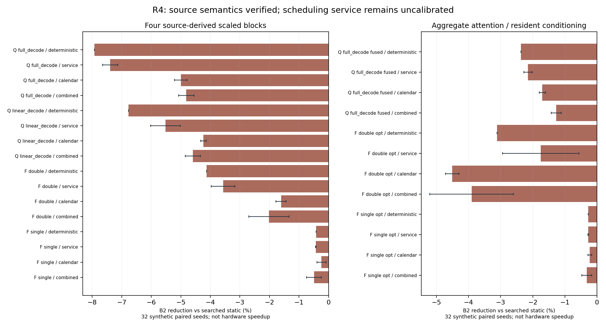

# R4 阶段实验报告：先检验真实来源子图的剩余机会

日期：2026-09-05。**收费 B2 未有配置通过预登记5%证据门，暂不扩展有限总事件硬件。** 本轮完成官方版本核验→真实源码缩尺图→独立数值检查→强化静态→实际仿真→独立红队闭环。这里“真实来源”指官方计算结构可追溯；并非完整4B形状、真实训练权重或真实NPU性能。

## 1. 本轮完成与主结果

- 7种源图边界（4基础、3 attention/conditioning 优化），共 **70配置 × 32独立test seeds × 6策略 = 13,440次**主执行。所有执行完整trace保存在压缩JSONL，合同、地址、shape、各tensor bytes/readers、搜索候选与源hash一并冻结。
- 收费B2相对S：0个配置mean为正，70负，0零；通过5%且区间下界>0门槛的配置 **0**。这是重叠合成配置的计数，不是模型总体胜率。
- 最大B2改善为 **-0.223%**（`flux2_klein4b_single_scaled_attention_aggregate_cond_resident__two_core__calendar`），最差 **-9.998%**（`qwen35_full_decode__dma64__service`）。完整零成本增量B0、B8与H2均公开，未筛掉退化。
- 更强静态S是24优先级池+128次合法顺序局部候选、独立validation选择，仍是有预算的搜索。S8在1个配置test均值上快于S；因此不能宣称S是全图最优。确定性结果不能归为未知完成信息。
- 原始七任务source FFN切片：52拓扑序投影6个资源序；最优固定期望 **3665.0 cycle**，B **3665.0**，逐场景clairvoyant均值 **3665.0**；局部搜索exact gap **0.0%**。只对指定二点分布、零控制成本、此固定映射成立。
- 420个实际调度数值重放（每配置seed0的全部6策略）输出/状态与独立FP64参考最大绝对误差 **6.66e-16**。它不验证BF16舍入、模型质量或实际物理payload；物理alias另由独立trace checker验。

## 2. 模型与工作范围

Qwen官方4B文本部分4.206B、完整发布物4.660B；本轮具有GatedDeltaNet与gated GQA两种有状态文本层。FLUX.2-klein-4B主网络3.876B，4步step/guidance distilled；文本编码器另4.022B，VAE另约0.084B。主实验CFG=1单次条件调用，未强加cond/uncond双分支。[完整模型冻结](model_registry.md)、[Qwen来源](qwen_model_evidence.md)、[FLUX来源](flux_model_evidence.md)

Qwen H80/I288，保留原head比例但head维缩小32倍；FLUX H64/heads4、image16/text8。下表cycle全部来自这些缩尺图，不能换算token/s或image/s。数值计算为随机权重FP64；容量模型默认BF16并仅通过显式表覆盖FP32 recurrent/参数。

Source-level融合已经保留QKV/gate-up，FFN按intermediate两片、attention按head或query-row两片；编译器再合并同核单消费者VPU链。operand pack预取、双槽/core与显式last-reader WAR共同服务所有策略；live-out缓存/状态钉到调用结束。attention aggregate是精确数学组合的边界对照，内部scratch和流量仍计费；它没有实现online softmax或FlashAttention。FLUX conditioning-resident对照将每步共享producer移出单block边界，仍计读取；整pipeline仍须每step支付共享计算一次。

## 3. 对照与结果

S8：继承8候选池、train选固定计划。S：扩展24 priorities和128个合法局部移动、validation选冻结计划。B0：completion-ready，只有共同控制成本；B2/B8另加2/8cycle每task决策/dispatch延迟。H2保留MXU/VPU顺序，仅DMA/SRAM按ready仲裁，并加2cycle。所有策略同一mapping/address/legal DAG/工作量/环境；没有test未来时长挑静态计划。

训练10000..10011，validation20000..20007，test0..31。模型随机权重family builder种子7，linear/single实际种子8。S8与S各只选一次；各策略每seed共享同一环境hash。日历场景固定绝对时间可用服务，相同task的时长可能因开始时刻改变；应用排队重新计算。

主/融合边界全表，正数表示比S快。区间是32个合成seed的近似配对均值95%区间，仅反映采样误差，不含模型误差，也未做多重比较校正。

| case | uncertainty | S mean cycle | B0改善 | B2改善 [95%] | H2改善 |
|---|---|---:|---:|---:|---:|
| qwen35_full_decode | deterministic | 7882.00 | -7.343% | -7.926% [-7.926,-7.926] | -7.926% |
| qwen35_full_decode | service | 8318.55 | -6.832% | -7.391% [-7.649,-7.134] | -7.391% |
| qwen35_full_decode | calendar | 11890.96 | -4.361% | -5.002% [-5.211,-4.792] | -5.002% |
| qwen35_full_decode | combined | 12600.95 | -4.370% | -4.815% [-5.079,-4.551] | -4.815% |
| qwen35_linear_decode | deterministic | 9201.50 | -6.379% | -6.771% [-6.771,-6.771] | -6.771% |
| qwen35_linear_decode | service | 9386.92 | -5.129% | -5.520% [-6.026,-5.013] | -5.520% |
| qwen35_linear_decode | calendar | 13757.21 | -3.996% | -4.235% [-4.328,-4.142] | -4.235% |
| qwen35_linear_decode | combined | 13795.73 | -4.331% | -4.592% [-4.852,-4.332] | -4.592% |
| flux2_klein4b_double_scaled | deterministic | 12939.06 | -3.694% | -4.127% [-4.127,-4.127] | -4.127% |
| flux2_klein4b_double_scaled | service | 13415.89 | -3.198% | -3.571% [-3.974,-3.168] | -3.542% |
| flux2_klein4b_double_scaled | calendar | 18524.57 | -1.287% | -1.605% [-1.777,-1.433] | -1.605% |
| flux2_klein4b_double_scaled | combined | 19022.79 | -1.819% | -2.016% [-2.697,-1.336] | -2.197% |
| flux2_klein4b_single_scaled | deterministic | 10575.56 | -0.009% | -0.426% [-0.426,-0.426] | -0.426% |
| flux2_klein4b_single_scaled | service | 10474.51 | -0.010% | -0.431% [-0.439,-0.423] | -0.431% |
| flux2_klein4b_single_scaled | calendar | 13249.83 | +0.000% | -0.243% [-0.395,-0.090] | -0.243% |
| flux2_klein4b_single_scaled | combined | 13147.17 | -0.139% | -0.493% [-0.748,-0.238] | -0.493% |
| qwen35_full_decode_attention_fused | deterministic | 7882.00 | -1.935% | -2.366% [-2.366,-2.366] | -2.366% |
| qwen35_full_decode_attention_fused | service | 8312.50 | -1.734% | -2.147% [-2.279,-2.016] | -2.147% |
| qwen35_full_decode_attention_fused | calendar | 11890.96 | -1.285% | -1.702% [-1.794,-1.610] | -1.702% |
| qwen35_full_decode_attention_fused | combined | 12603.45 | -1.000% | -1.269% [-1.420,-1.117] | -1.269% |
| flux2_klein4b_double_scaled_attention_aggregate_cond_resident | deterministic | 9510.00 | -2.713% | -3.113% [-3.113,-3.113] | -3.113% |
| flux2_klein4b_double_scaled_attention_aggregate_cond_resident | service | 9802.87 | -1.359% | -1.749% [-2.938,-0.559] | -1.749% |
| flux2_klein4b_double_scaled_attention_aggregate_cond_resident | calendar | 13143.49 | -4.014% | -4.511% [-4.721,-4.301] | -4.511% |
| flux2_klein4b_double_scaled_attention_aggregate_cond_resident | combined | 13449.69 | -3.616% | -3.905% [-5.208,-2.602] | -3.905% |
| flux2_klein4b_single_scaled_attention_aggregate_cond_resident | deterministic | 8462.00 | -0.012% | -0.272% [-0.272,-0.272] | -0.272% |
| flux2_klein4b_single_scaled_attention_aggregate_cond_resident | service | 8433.91 | -0.012% | -0.274% [-0.281,-0.267] | -0.274% |
| flux2_klein4b_single_scaled_attention_aggregate_cond_resident | calendar | 10534.16 | +0.001% | -0.223% [-0.284,-0.162] | -0.223% |
| flux2_klein4b_single_scaled_attention_aggregate_cond_resident | combined | 10494.26 | -0.055% | -0.320% [-0.474,-0.166] | -0.320% |

全部70配置和B8、p95、SRAM高水位见 [summary.csv](../experiments/results/r4/summary.csv)；逐seed见 [samples.csv](../experiments/results/r4/samples.csv)。

### 3.1 后验修正：让动态priority跟随优化静态

主B采用原始critical-path priority，而S已通过离线搜索改变资源序。为排除可修复的hint不匹配，另运行 **70×32×2=4,480次**：先用nominal确定环境回放S，把dispatch全序转成静态priority，再按相同地址/工作/外部环境测试B_order0/B_order2。所有hint在读取test评分前冻结；这仍是看到主结果后的后验校正，不是新硬件或独立确认实验。

B_order0为10正/33负/27零；收费B_order2为2正/68负，最高 **+0.197%**，配对95%区间 **[-0.152,+0.546]%**，仍无5%门通过。这个最高行是 `flux2_klein4b_double_scaled__split_engine_ports__service`。修正hint显著减少部分退化，说明原始负值不能全归于动态机制固有缺陷；但没有改变本轮暂不扩硬件的决定。[完整校正汇总](../experiments/results/r4/priority_probe/summary.csv)、[独立来源/参数清单](../experiments/results/r4/priority_probe/manifest.json)

红队另对主B0两处约0.10%小正例做训练trace静态修复：只用12训练B trace导出额外固定资源序，再由8 validation选择。每配置得到2个unique候选，最终仍选原S，未消除微小正值；这不证明全图静态最优。[后验静态探针](../experiments/results/r4/redteam_static_probe.json)

主实验与priority校正合计 **17,920次执行**，不把训练搜索或tiny枚举混入该总数。主420与校正140个seed0调度数值检查分开保存，全部通过。


## 4. 等待是否真的可恢复

S的2240条trace中，1227条有非零“全部依赖和地址合法、所需资源与issue lane空闲”的替代任务等待并集，2240条出现相邻资源序的依赖就绪反转。这些计数不是critical-path收益，也不是各task等待之和。

seed0最多选6个候选单动作干预，共120个离线反事实：16次缩短结束时间、84次增加，20次不变。它们从S的真实机会点提前一个合法任务，随后继续原资源顺序，使用同一外部环境；只衡量这一动作的最终makespan因果效果，不声称求得最优在线策略或固定critical path。改变calendar相位时，效果也包括后续任务重新遇到的背景服务。

因此“出现ready inversion”“某时有空闲资源”“某个局部动作有效”和“整个B策略净获益”必须分别报告。B能抢先占用DMA/SRAM，也可能让后到的关键消费被非关键预取阻塞；它不提高带宽，且所有task额外控制成本都会计入。实际机会/成本摘要在 [opportunity_cost_summary.json](../experiments/results/r4/opportunity_cost_summary.json)，逐动作结果在 [counterfactual_summary.json](../experiments/results/r4/counterfactual_summary.json)。

## 5. 硬件、敏感性与成本

主假设为单cluster双core，一共享DMA/1 outstanding，每core MXU+VPU，两个静态SRAM端口、4MiB共享容量，DMA32B/cycle、每SRAM端口64B/cycle、每core1024 MAC/cycle、VPU32估计ops/cycle。R1与Arm官方文档只是量级参照；没有把这个BF16组合命名为量产芯片。

主模型的同核MXU/VPU全程共享port，无法同核重叠，故另外跑**四个半带宽端口**（总128B/cycle不变）：MXU与VPU/DMA绑定不同端口，允许同核异构流水。这个对照与DMA16/64、SRAM1port、operand1/4slot、容量2/8MiB都各自重新训练静态。它们不是等面积比较；容量扫描未扩满小图需求不能证明真实4B不受容量限制。Qwen真实单层S本身已有2MiB。

资源整task原子保留，dispatch也占资源；aggregate attention保留双engine。MAC/SRAM算术模型没有阵列填充、实际bank/beat/flit/credit，32×32仅是R1 tile量级锚点，不是实现过的array timing。compute确定；独立外生DMA倍率U[0.5,1.5]；周期256、半周期0.25服务率的共享背景日历及组合，均未校准。不同随机源与调度排队分开。

共同issue1/cycle、dispatch1、completion1、wakeup1/cycle，128 resident/32KiB descriptor窗口。所有trace有ready/notification/completion峰值、resource占用率、issue/wakeup服务率、candidate scans及独立task-wait分类。日历下service utilization为占用区间，不是有效字节吞吐。

Descriptor沿用假想48+5×fanin+8×resources bytes；state是带完整done/delivered/通知history的部分logical bits。静态order metadata独立列出，输入/地址layout完整在JSON合同中；模拟器实际消费Python Contract，未作二进制decode。没有有限总事件状态、FIFO credit/backpressure、RTL、面积/Fmax/能耗数据。

主B2在本批图的部分state预算1,529–7,421 bits，descriptor估计851–3,654B，ready峰值2–10、待通知峰值2–7；平均issue端口利用率各配置最大0.581%，wakeup最大0.835%。低平均服务率不等于burst时延无关，也不证明面积可忽略。完整resource占用率、queue和控制成本已逐配置导出。

## 6. 独立审计与可复现性

[独立红队报告](redteam_report.md) 和 [checker](redteam_checks.py) 逐项记录live-out复用、非事件时刻干预、静态metadata漏计、admission截断inversion、融合scratch、dtype字符串启发式等发现与修复。主sweep在最终修复后重新运行，源码hash不匹配会拒绝完成。主报告不把checker PASS升级为真实芯片验收。

```powershell
python -X utf8 -B -m unittest discover -s tests -v
python -X utf8 -B -m r4.qwen_lowering
python -X utf8 -B -m r4.flux_lowering
python -X utf8 -B -m r4.run
python -X utf8 -B -m r4.exact_probe
python -X utf8 -B -m r4.redteam_checks
python -X utf8 -B -m r4.redteam_checks --artifacts
python -X utf8 -B -m r4.priority_probe
python -X utf8 -B -m r4.redteam_priority_audit
python -X utf8 -B -m r4.redteam_static_probe
python -X utf8 -B -m r4.make_report
python -X utf8 -B -m r4.check_artifacts
```

Python 3.14.0 / NumPy 2.3.5 / Matplotlib生成图；无新安装依赖、无大权重、无Git提交。原始R3源码快照与27文件hash、257旧结果hash见 [r3_snapshot/manifest.json](r3_snapshot/manifest.json)。执行源码、所有参数/seeds、运行计数见 [manifest.json](../experiments/results/r4/manifest.json)。counterfactual只认manifest中active清单，避免中断试跑残留混批。

## 7. 阶段决策

收费 B2 未有配置通过预登记5%证据门，暂不扩展有限总事件硬件。 即使某个更细边界出现局部机会，也还缺全宽状态/权重tile、实测服务日历与独立硬件代价，不能声称“所有强编译器之后必然需要OoO”。当前没有确认论文或专利novelty。[假设台账](hypotheses.md)、[拒绝/细化方向](rejected_refined_directions.md)、[下一轮](next_round.md)、[最近先例差异](prior_art_delta.md)。


