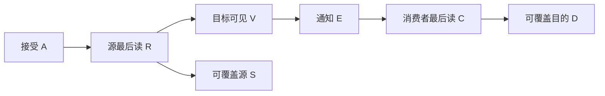

# R8：多 cluster 的静态分片与 payload 可见性合同

日期：2026-09-05。**本轮接受来源约束的账本与单 payload 安全证书，下一决定是取得目标 admission 与实际传输路径。没有发现或否定真实多 cluster 性能残差；不重开 R5 通用 ready 候选。**

R8 已完成一次有边界的科研闭环：事前登记 → 两种多 cluster 静态 mapping 与单 cluster 控制 → CPU 数值及完整有限事件枚举 → 独立复算/红队 → Accept/Refine/Reject。没有新的 NPU 运行、RTL、时序仿真、干扰 pair 或性能收益结果。原 R1–R7、交接计划行和冻结工件保留。

## 问题与最有判别力的选择

[来源审计](source_contract_audit.md)重新区分了历史 TARS 单 cluster 双核和待建的两 cluster 双核/cluster 合同；[层级审计](hierarchy_static_audit.md)发现 R3 的 `exchange` 只是固定服务的抽象互斥任务，没有逐 tensor payload、共享外存端口或独立 destination-visible 阶段。不能从该模型直接推导 R8 的资源或完成协议。

本轮选定的资源问题是：**若跨 cluster partial 必须通过与 X/W 共用的外存/DMA，先确认这种搬运是否由已许可的静态 mapping 强制，再辨认其服务变化是否留有可行动残差。** 在当前入口缺失时，账本与因果安全能够核验；后半句的真实性、规模和可恢复性仍未测。

| Research Question | Hypothesis | Strong Baseline | Discriminative Experiment | Result → Decision |
| --- | --- | --- | --- | --- |
| 跨 cluster partial 归约是工作量必需，还是随 mapping 改变？ | 同一 source contraction 可 output-shard 而不跨域归约；split-K 的取舍依赖 input replication、route 与数值许可。 | 同一外存 X/W 起点、同一外存 Y 终点；两种四核 mapping 共同预算，另列两核控制；保留广播、驻留、tiling、buffering 的真实准入要求。 | full K=9216/N128/M1,32；逐 core 分片、bytes、live-set、覆盖检查；3 seeds×2 M×3 mappings 的数值验证。 | 没有 mapping-independent 的 partial 必需量；单播合同下 split-K 少 input delivery、增 partial/reduction；broadcast 合同下外存下界不同。**Accept 先完成静态/路径合同；不排名性能。** |
| “DMA完成”是否同时允许 consumer 和 buffer reuse？ | 接受、源最后读取、目标可见、consumer最后读取不可未经证明互相替代。 | self-timed 静态 wait/release，允许 blocking copy 或任意已证明的等价 happens-before；不预设新信号 ISA。 | 对单 sentinel payload 的五种七事件偏序枚举全部70线性扩展，执行状态读取并保存每个 witness。 | safe与保守release共9序全部正确；三类故障共61序中37个错误。**Accept 该有限抽象的安全/反例证书；Reject 由此推出 target bug 或新 scheduler。** |

完整 [事前计划](experiment_plan.md) 和 [运行前补注](prerun_clarifications.md) 的 hash 均绑定在 [原始回执](results/receipt.json) 中。生成器的区间、rounding和顺序在首次执行前的同一源码 hash 固定：NumPy PCG64/default_rng，先生成 X∈[-0.25,0.25)，再生成 W∈[-0.125,0.125)，FP32 表示并 round-to-nearest-even 为 BF16。没有依据结果调整 seed、范围或诊断容差。完整数值输入和输出保存在6个 NPZ，拒绝逐 bit 等价的反例也保留。

## 工作量、资源和驻留账本

官方固定 [Qwen config](https://huggingface.co/Qwen/Qwen3.5-4B/blob/851bf6e806efd8d0a36b00ddf55e13ccb7b8cd0a/config.json) 给出 I=9216/H=2560；固定 [MLP源码](https://github.com/huggingface/transformers/blob/f62dc9bf2c90353b442a56e74391fbb8c689b55e/src/transformers/models/qwen3_5/modeling_qwen3_5.py#L822-L835) 的 down 为无 bias `Linear(I,H)`。本轮取完整 reduction K 与输出 [0,128)，不继承 R5 gate/up 数值验收为 down 验收。输入为 prepared BF16 down input，输出人为保留 FP32；既非官方完整 FFN，也非真实模型输入分布或质量验证。

机器可读 [target contract](target_contract.json) 将 current checkout、实际可用 VMEM、带宽、bank、DMA outstanding、multicast、peer route、数值许可、设备观测明确保留为未知。没有用旧 Phoenix 或 R3 参数填空。每 core 4 MiB 只用于历史启发的研究上限。

以 **M=32** 为例，以下均为逻辑 payload bytes；实际bus beats、padding、descriptor/packet/retry、packing和控制成本未计量。三方案均有37,748,736 logical MAC、2,359,296 B权重与16,384 B最终FP32输出；C2K另有4,096次FP32 adds。

| 项目 | C1N：一cluster/两核，N64/core | C2N：两cluster/四核，N32/core | C2K：cluster切K，core切N64 |
| --- | ---: | ---: | ---: |
| private VMEM 输入 delivery | 1,179,648 | 2,359,296 | 1,179,648 |
| direct peer partial | 0 | 0 | 16,384 |
| 单播、direct route 的外存总payload | 3,555,328 | 4,734,976 | 3,555,328 |
| 单播、external-staging 的外存总payload | 3,555,328 | 4,734,976 | 3,588,096 |
| per-core full-resident 最大 live-set | 1,777,664 | 1,183,744 | 901,120 |
| Ktile128/512、单/双buffer live-set范围 | 32,768–204,800 | 20,480–135,168 | 32,768–212,992 |

每条输入、权重、partial和输出 transfer的 span/owner、等待/完成事件在 [逐core账本](results/resource_payload_ledger.json)。20个core实例共有100个分配布局（full resident及4个tiled配置）；研究地址区间不重叠，K×N工作/权重覆盖无漏算重算、外存Y完整覆盖。tiled项只验证 live-set分配，**没有展开tiling后的descriptor/transfer执行**；packed地址与strided加载也尚未target-admitted。全部fits不能认证保留区、bank冲突或真实占用。

这张表不能相减为 elapsed 改善。若硬件理想multicast只从外存读取一份X，两种四核mapping的direct外存payload下界同为2,965,504 B；C2K若staging则额外32,768 B。前一个表的单播差额因此不具备路线无关的瓶颈意义。不同资源的 bytes 也不能不考虑路由而按相同代价相抵。

输出边界对两种mapping一致：N-shard各core直接store自己不重叠的Y，K-shard在cluster0归约后store。没有给N-shard添加无来源的gather。若后继要求cluster0驻留，需要重新定义边界并计其移动；若允许跨层fusion/输入驻留，prepared-input冷读边界也须重开。C1N算力不同，仅作局部控制，不作四核公平性能比较。

## 数值结果：容差通过不代表 split-K 已获许可

[数值结果](results/numerical_results.json)的18个比较全部通过事前诊断容差 `5e-5 + 5e-5*abs(FP64 reference)`，最大绝对误差约1.029×10⁻⁵。C1N/C2N均保持显式ascending-K FP32累加，逐bit等于同序基线；六个C2K结果均有不同元素（M1各121–126个，M32各3,874–3,885个）。

另一个冻结BF16抵消反例把四个非零权重设为 `[100139008,1,-100139008,1]`，分别放于K索引0、1、4608、4609，X全1。同一实数contraction，顺序FP32结果为1，split-K FP32为0，FP64为2。**明确拒绝“代数等价或随机容差通过即可默认target允许split-K”**；两种FP32算法都可能偏离精确结果。实际模型质量、允许的reassociation、partial export和最终BF16 cast均未认证。

M=1只是逻辑decode slice与CPU验证；R1历史MXU要求M/N/K为32倍数。没有免费的native tail、padding、zero-fill或物理MAC推论。M=32只吻合历史几何，仍无BF16/FP32硬件准入证据。

## Completion / release 反例与安全证书

E2从一个**已经在source可读**的sentinel partial开始。A=接受传输，R=源最后读取并捕获到单word transport，V=目标可见，E=consumer通知，C=consumer最后读取，S/D=源/目的各覆盖一次。基本物理假设A<R<V；没有时钟、延迟分布、链路credits或概率。



| 偏序变体 | 全部线性扩展 | 错误扩展 | 一个实际执行的witness |
| --- | ---: | ---: | --- |
| safe：V后通知，R后源复用，C后目的复用 | 5 | 0 | 全部读到11 |
| early event：A后即可通知 | 40 | 26 | A,R,E,C,V,S,D：读到目的旧值−7 |
| early source reuse：A后即可源复用 | 6 | 1 | A,S,R,V,E,C,D：传到并读到新源值97 |
| early destination reuse：V后即可目的复用 | 15 | 10 | A,R,V,E,S,D,C：读到覆盖值53 |
| conservative source release：V后才源复用 | 4 | 0 | 全部读到11 |

[全部70条执行记录](results/event_extensions.jsonl)与[汇总](results/causality_results.json)保留，37不是概率或真实错误率。safe比保守release多允许一个顺序，仅说明更宽的安全偏序；没有服务时长，不能称减少stall或提升并行性能。

这是声明的单次snapshot传输抽象的**充分性和故障反例**，不证明某个显式event编码是所有实现必需。blocking DMA、保守阻塞等待或其他已证明等价的happens-before同样可满足。未覆盖producer→DMA可读、两个partial并发、完整reduction图、最终Y外存可见、credit/反压、错误/重试或generation复用；不称完整C2K或target RTL端到端安全验收。

## 独立红队与决定

[独立checker](redteam_check.py)不import主runner，以frexp/rint重建BF16、cumsum重算有序FP32、另一种FP64求和及独立偏序枚举核对全部输入/输出hash、100个布局和70条事件记录，结果 [PASS](redteam_results.json)。完整限制和审查见 [红队报告](redteam_report.md)。没有账本、数值或有限偏序实现错误需要改跑；红队指出的M1准入、输入/输出边界、FP32顺序、tile未展开和等价阻塞合同均在本报告保留。

- **Accept**：来源清楚的最小2cluster×2core研究合同、精确逻辑账本与单payload有限安全证书。两种静态mapping的资源取舍有可核验公式。
- **Refine**：当前TARS入口、两种mapping的native许可、input multicast/partial路线与completion绑定。现有材料不足以选择实际最优静态方案，更未建立strong-static之后的真实残差。
- **Reject 本轮过度推论**：跨cluster依赖必然需要新scheduler、split-K已数值admitted、target有上述故障、低字节数就是延迟收益、结构验证通过就是性能/PPA通过。

下一步已收敛为 [精确入口取证](next_target_intake.md)，只需当前权威TARS顶层路径。没有新的Phoenix profiler/SDK工作：R7固定copy/INT8及host elapsed不能回答本轮BF16 shared-path/remote-visible问题。停止增加未校准时序模型；R5已测ready继续关闭，未测多cluster空间保持未决。

未来机制门不变：真实残差、strong-static不能消除、因果可观测、有限合法动作、收费后净收益全部成立；确认时独立train/validation/test、≥5%净elapsed、95%paired CI下界>0、每条件每session≥30独立paired blocks、第二session新相位、至少两个非极端干扰、quiet均值回退≤1%。本轮确认/静态性能/动态比较样本数均为0。

## 复核与历史

原始结果目录不覆盖；要重新生成需指定新的目录：

```powershell
python -X utf8 -B r8/contract_experiment.py --output r8/reproduction_new
python -X utf8 -B r8/redteam_check.py
python -X utf8 -B r8/check_results.py
python -X utf8 -B r8/check_history.py
```

进度父为冻结的 `r8/history/aligned_research_progress.md`，实际R8结果追加后另存successor快照与 [新lineage](history_lineage.json)。R8结果清单只冻结本轮明确列出的工件，不改handoff或R4–R7清单；后续同样保存父子关系后再追加。根README不变。
