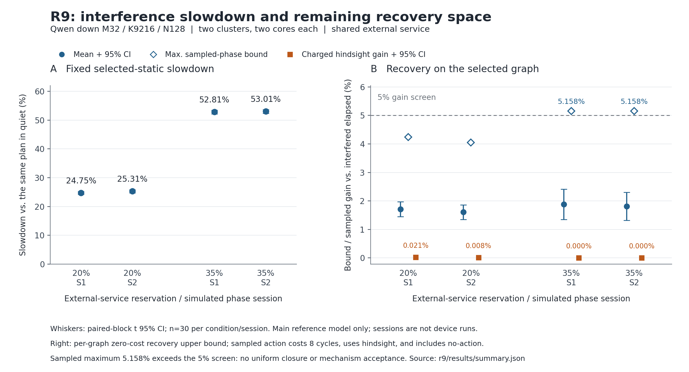

# R9：共享外存供给、强静态与有限 DMA 改序

2026-09-05。**已完成参考硬件建模和可复验实验。两档背景使同一静态计划平均慢约25%和53%，但已测单动作 DMA 改序的收费回看恢复均值最高只有0.0210%。本轮拒绝该已测动作族的5%收益主张；不新增 scheduler。严格的“所有已测相位免费恢复上界均小于5%”关闭门并未全部通过，强干扰和部分带宽比例仍须保留为未决范围。**

这是用户授权自主选定的两 cluster×两 core **条件性参考模型结果**，不代表当前 TARS、真实设备残差、硅后收益、完整模型质量或 PPA。未继续 Phoenix SDK 工作，也没有因缺少真实 TARS 参数停止本轮实施。原 R1–R8、根 README、旧 manifest 和 R8→R9 计划行保留。

## Research Question → Hypothesis → Experiment

完整事前内容见 [experiment_plan.md](experiment_plan.md)、[首跑前补注](prerun_clarifications.md)、[来源审计](source_and_scope_audit.md) 和 [设计审查](design_review.md)。首跑前回执 [prerun_registration.json](results/prerun_registration.json) 保存硬件、程序、计划、补注、冻结 Qwen 来源 hash、204个完整候选及全部相位。预跑审查修复了决策字段不一致和登记 hash 遗漏；主结果运行后没有改模型、扩大候选或调参数。

| Research Question | Hypothesis | Strong Baseline / 判别实验 | Result → Decision |
| --- | --- | --- | --- |
| 固定静态的外存干扰损失主要属于供给下降还是可恢复等待？ | 大部分 elapsed 变化由共同供给约束解释，不能把全部变慢归给调度。 | 同一 quiet-selected graph 在quiet/20%/35%预留背景配对；共同绝对供给曲线给乐观资源下界。 | 损失约25%/53%，平均零成本恢复上界约1.6%–1.9%。**Accept 主参考中供给解释占主导的条件性证据。** |
| 更强静态重训能否消除额外损失？ | mapping、broadcast、tiling、buffer、layout和并发要先于新机制。 | 每 mapping 68候选，独立train/validation；固定quiet选择与环境重训选择在新test比较。 | 四核main三个环境均选同一C2K/K256/双buffer方案，重训消除量0；已有静态选择显著影响quiet表现。**Accept strong-static控制；不是全静态最优证明。** |
| 既有仲裁之外的单次合法改序能否改变最终结束且达到5%？ | 有eligible替代请求不保证显著恢复，必须重算全部后续共享服务。 | 每block固定检查最早4/最晚4个eligible选择点；一次改变一个请求，收费0/8cycle；另算资源恢复上界。 | 2,880次单动作执行；最高条件/session收费回看均值0.0210%，CI跨0。35%条件为0。**Reject已测动作族的5%收益主张；Refine更广动作与参数范围。** |

## 参考硬件与完整 payload 路径

所有性能数值集中在 [reference_hardware.json](reference_hardware.json)，规则在 [model_notes.md](model_notes.md)。32倍数几何、4MiB VMEM和64KiB保留区仅受历史记录启发；下面的速率、队列、延迟和能力都是明确研究选择，未冒充 TARS 校准。

| 资源 | 主参考数值 / 合同 |
| --- | --- |
| topology / compute | 2 clusters×2 cores；每核1024 MAC/cycle，32×32×32合法几何，启动8cycle；独立operand端口128B/cycle |
| 私有 VMEM | 每核4MiB，保留64KiB，实际分配从保留区后开始；完整地址和别名生命周期可审计 |
| cluster DMA | 每cluster一条64B/cycle服务；8个命令槽，最多4个outstanding、4个8192B transport槽；可静态降低outstanding |
| 共同 EXT | 全部cluster共用64B/cycle；4096B最大request、32B beat，固定请求延迟12cycle，最终可见延迟4cycle |
| 广播 | 仅cluster内两核；EXT读一次，local DMA交付两份、计两份bytes，credit保持到双方可见 |
| 跨cluster partial | 只用同一EXT staging写后读，外存scratch16KiB；没有direct peer、附加带宽或完整NoC |
| 数值 | prepared BF16 X/W；研究FP32 partial/Y。明确准许N分片顺序FP32与K分片两半FP32后P0+P1这两种算法；不承诺它们逐bit相同 |

固定工作量是有冻结官方来源的 Qwen down **M32/K9216/N128** 切片，37,748,736 MAC。输入从相同的外存 row-major X[M,K]/W[N,K]开始，终点为全部不重叠 Y 外存可见；不要求N-shard额外gather。M1未纳入，Ktile1024在K4608 shard尾部真实执行K512，不漏算也不免费padding。不是完整MLP或真实激活/权重质量验证；R8的split-K抵消反例继续有效。

[model.py](model.py) 展开每个 tile、源跨度、目的地址、packet 和依赖。读请求走 latency→EXT→cluster DMA→visible，写请求走 latency→cluster DMA源最后读→EXT→visible。先处理同刻全部完成，再仲裁；未就绪命令不占命令槽；已有固定优先级准入与RR packet仲裁保持work-conserving。消费者等全部目标可见，slot refill等所有前一代reader结束；staging写/read/reduction/store是实际独立操作。FP32累加P在tile间的读写和最终归约operand traffic进入core服务时间。

这是分离DMA与core端口、无bank冲突/缓存/重试/refresh/时钟漂移的一个理想化参考。2D gather是显式许可的源跨度聚合能力，没有给输入免费预打包。模拟器中的图和trace是验证工具，不是已实现的RTL队列/事件表或PPA证书。

本轮引擎推进地址、payload requests和服务时间，没有在每条性能trace中物化BF16乘加数组；新布局检查覆盖源行→紧凑VMEM→compute tile的身份映射，不能代替数值kernel验收。数值算法准入是本轮显式研究合同，R8数值诊断保留为历史证据，不冒称R9重新完成数值或模型质量验证。

## Strong-static 与来源一致的 bytes

[training.json](results/training.json) 为204个候选分别保存quiet及两个背景的8个训练相位；[validation.json](results/validation.json) 对分组top4合并后的25个候选使用8个新相位。主问题仅在同一四核预算的C2N/C2K中选择；C1N为独立两核控制。完整参数交互没有全枚举，额外维度采用预登记的结构化探针。test前冻结 [selection.json](results/selection.json)，没有从test挑方案。

三个主环境均选 `107df77bc857`：**C2K、Ktile256、双buffer/prefetch2、tile X、cluster内broadcast、gather、outstanding4**。reverse与forward锚点在训练中完全相同，ID tie-break选了reverse，不构成反向顺序优势。

| 方案 | EXT bytes，含Y与staging | 主参考quiet elapsed |
| --- | ---: | ---: |
| C2K强静态，cluster广播 | 2,998,272 | 47,776 cycle |
| C2N强静态，cluster广播 | 3,555,328 | 55,912 cycle |
| C1N quiet选择，单播，两核控制 | 3,555,328 | 56,512 cycle |

C2K广播的EXT账为589,824 X + 2,359,296 W + 16,384 Y + 32,768 staging。cluster0/1的local DMA分别为1,802,240/1,785,856B，广播复制没有遗漏。主两种mapping里C2K已达到解析EXT最小bytes；C1N若广播的EXT虽更少，其单DMA仍须交付3,555,328B，不能单凭EXT bytes排性能，更不能把两核/四核差异叫调度收益。

主参考quiet C2K比已选C2N快14.5514%，这是**mapping与traffic的静态取舍**。训练池已有对照显示outstanding1为58,416cycle，而outstanding2为47,800；row请求数5,832对gather732，quiet为48,188对47,776；full-X驻留没有减少本切片X重读量，quiet48,216。它们只是已有训练候选的解释，不是新增的独立确认消融。详见 [static_interpretation.md](static_interpretation.md)。

## 两组独立 test 的损失、静态消除与恢复上界

每组模拟session、每条件30个独立paired phase blocks；两组共180个主配对块。它们是独立PRNG相位组，不是重启实机session。背景每8192cycle预留20%或35%服务，使用相同绝对phase，允许服务在预留期间暂停。其他policy只能改变自身排队，不能改变背景或复用另一policy的内生latency trace。

loss分母为同一quiet-selected plan的quiet elapsed；gain/恢复上界分母为该block的interfered selected elapsed，二者不可直接相减。表中CI是每组30个paired block百分比均值的95% t区间。quiet确定性重复的零宽CI不提供额外设备稳定性证据。[全部配对](results/test_pairs.json)、[汇总](results/summary.json)。

| 条件 / phase组 | 固定静态变慢% [95%CI] | 环境重训静态消除% | 免费恢复上界均值% | 已测phase上界最大% | 收费单动作回看最佳均值% [95%CI] |
| --- | ---: | ---: | ---: | ---: | ---: |
| quiet / 两组 | 0 | 0 | 1.9424 | 1.9424 | 0 |
| 20% / s1 | 24.7543 [24.2511,25.2574] | 0 | 1.7077 | 4.2404 | 0.0210 [−0.0030,0.0451] |
| 20% / s2 | 25.3070 [24.7773,25.8367] | 0 | 1.6066 | 4.0514 | 0.0080 [−0.0037,0.0197] |
| 35% / s1 | 52.8112 [52.1682,53.4542] | 0 | 1.8776 | 5.1579 | 0 |
| 35% / s2 | 53.0114 [52.3630,53.6598] | 0 | 1.8092 | 5.1579 | 0 |

资源下界为 `L=max(共同绝对EXT供给从0服务完必需bytes的最早时刻，各cluster DMA工作量/速率，各core必需占用)`。它放松了依赖、latency和有限window，因此是真实模拟执行的乐观下界；`(T−L)/T` 是零成本恢复的**上界**，不是已恢复的损失。主参考该下界由EXT主导；仅对已声明两种main mapping，最低EXT bytes也可解析证明。不能外推所有算法、mapping、peer路线或初始驻留状态。

主参考quiet距下界46,848cycle仅928cycle。20%背景两组已测相位上界都小于5%，因此这些配对实例里连免费重排也不能达5%。**35%背景每组的最大上界5.1579%使事前更强关闭门失败**：不能宣布所有已测相位、更不能宣布连续phase域均无5%空间。较大gap出现在最乐观供给完成点位于下一预留区之前而真实尾部跨过预留区的情形；这是解释，不证明有合法动作能恢复gap。本轮不事后强化下界以改写预登记判决。



## 单动作因果筛查及收费边界

每block从baseline轨迹的最早4、最晚4个多候选EXT选择点挑一个非默认ready请求，分别收费0/8cycle，总计2,880次重新执行。每次保持工作、地址、credit、供给过程不变，重算后续所有事件；可见信息中的eligible请求才允许被选。记录见 [counterfactuals.json](results/counterfactuals.json)，改善的详细轨迹也保留。

最晚选择点以及最终取最佳动作都使用了未来知识，因此它是**事后单动作筛查**，不是causal policy、全动作oracle或所有单次改序的穷举。统计最佳结果包含no-action，quiet的0不代表一个需要部署的新机制通过了≤1%回退门。单动作会改变后续时序，8cycle延迟偶尔可改变相位/排队而比某个0cost动作更好，故收费轨迹没有用简单减8伪造。

20%背景两组免费回看均值分别0.0215%/0.0075%，收费为0.0210%/0.0080%；两组收费CI均跨0。35%背景和quiet均未恢复任何elapsed。存在改变最终结束的少量合法动作，但规模远低于5%，且没有验证因果选择器或硬件总成本。因此**关闭本轮已测8个位置×首个替代请求的新增改序收益候选**，保留其他动作、相位与参数合同的未决空间；R5已关闭的通用ready仍不重开。

## 敏感性与明确失效范围

九个事前单参数变体各在固定12项子池独立train/validation选择，并跑相同两组独立test相位；小VMEM有4个非法配置被保留为拒绝记录，其余8项合法。这个敏感性静态池比主实验弱，不是每个变体的全静态最优证明。表为60个干扰test块中零成本上界的均值/最大值；没有对这些变体训练或确认新机制。[全部结果](results/sensitivity.json)。

| 单项变化 | 20%背景：均值/最大% | 35%背景：均值/最大% |
| --- | ---: | ---: |
| EXT 32B/cycle | 0.509 / 1.850 | 0.435 / 2.344 |
| EXT 128B/cycle | **18.347 / 19.859** | **17.883 / 19.216** |
| cluster DMA 32B/cycle | **13.811 / 15.894** | **13.751 / 15.410** |
| cluster DMA 128B/cycle | 1.387 / 3.976 | 1.471 / 4.951 |
| 每核512 MAC/cycle | 3.327 / 5.824 | 4.513 / 6.221 |
| 每核2048 MAC/cycle | 1.560 / 4.140 | 1.774 / 5.086 |
| 请求latency4cycle | 1.593 / 4.178 | 1.746 / 5.281 |
| 请求latency36cycle | 1.905 / 4.566 | 3.427 / 5.441 |
| 可用VMEM256KiB，另保留64KiB | 1.657 / 4.240 | 1.843 / 5.158 |

EXT提高或DMA降低使两级服务的比例变化，聚合资源下界与可执行流水之间出现较大gap。它可能来自下界松弛、静态子池不足、有限credit与串联服务，也可能含可行动空间；**当前证据不能区分，19.859%不是已实现收益**。没有挑这些参数追正收益，也没有把主参考负结果推广到这里。

## 独立复核、Red-team 与本轮决定

[independent_check.py](independent_check.py)不import simulator，独立积分供给曲线、复算下界，逐request核对源/目的覆盖、beat/bytes、广播复制、staging双腿、资源互斥、命令/transport/credit容量、DMA源最后读、目标可见、实际地址生命周期、MAC与K/N覆盖和最终Y完成。**最终608份详细轨迹、477,312个requests、57,232个compute/reduce操作全部通过**；独立重建76个无交集相位、25项validation shortlist和180个配对块，复算36组汇总统计。主测试的strong/quiet-selected及不同的C1N/C2N/C2K控制均保存完整轨迹；敏感性每条件/session首块保存详细轨迹，其余保留完整elapsed/lower-bound记录。回执见 [audit_results.json](results/audit_results.json)，独立意见见 [redteam_report.md](redteam_report.md)。

[check_tests.py](check_tests.py)的27个结构配置共50,404 requests通过；7个故障副本分别检出漏payload、提前消费、广播少计、服务cycle遗漏、DMA源last-reader别名覆盖、credit超限和transport提前复用。[故障回执](results/audit_tests.json)。tiny exact对两条已ready传输链的全部2种EXT顺序×2相位，独立整数tick枚举得到21/22、29/30cycle，与引擎一致；这个tiny终点是local VMEM-visible，明确不是主图的完整外存Y或主问题最优性证明。[tiny完整证据](results/tiny_exact_results.json)。

- **Accept**：用户授权的可替换参考硬件、来源一致的完整payload执行、共同绝对供给、有限资源审计和独立train/validation/test闭环。在主参考下，大干扰损失与小额外改序价值可以同时成立。
- **Reject**：本轮已测单动作DMA改序有≥5%收费收益的主张；不以其少量回看改善开发新scheduler，不重写R5负结果。
- **Refine**：35%背景的严格逐phase上界关闭门、EXT/DMA比例改变后的gap、有限静态池缺口及真正因果信息价值；也保留真实TARS准入、性能和PPA校准门。本轮没有接受任何硬件机制。

最小后续问题已经具名：在**同一shared-EXT-cluster-DMA-VMEM路径**的EXT128或DMA32预登记范围，先用覆盖串联服务/有限credit的更紧下界和更完整静态交互区分“松下界/静态不足”与“可恢复时序”。只有仍有端到端空间，再用全新的train/validation/test相位验证一个有限、因果且收费的动作；不直接把gap变成scheduler提案。真实TARS规格得到后只替换集中合同，并重新审核两种FP32算法、gather/广播能力和起终位置。

## 复现与历史

```powershell
python -X utf8 -B r9/run_experiment.py --output r9/reproduction_new --workers 4
python -X utf8 -B r9/independent_check.py --results r9/reproduction_new
python -X utf8 -B r9/check_tests.py --results r9/reproduction_new
python -X utf8 -B r9/check_results.py
python -X utf8 -B r8/check_history.py
python -X utf8 -B r8/check_results.py
```

主runner拒绝覆盖已有输出目录。首跑host运行约291秒只说明仿真脚本开销，不能与报告中的reference cycles兑换实机性能。主回执见 [completion.json](results/completion.json)。结果清单与新父子关系见 [results_manifest.json](results_manifest.json)、[history_lineage.json](history_lineage.json)。旧R9交接仅冻结原3个文件，新增实现/结果另行冻结；目录非Git仓库，没有commit或push。
