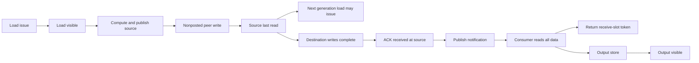

# R12：Wormhole 联合编译的执行语义资格验证

2026-09-08 开始。主线来自 [冻结 proposal 合同](../../SchedResearch_reassessment_evidence_20260907/proposal_contract.md) 和“科研方向重审”。本轮研究问题是：**正确移植强编译器之后，共享资源与分离完成事件是否仍会改变联合计划的优劣及完整模块 elapsed？**

本目录已建立本地依赖、可运行验证入口、来源审计、真实 TETRA 小例和第一批反例。当前是离线资格验证，**native G0 尚未通过，H1/H2 尚无设备性能证据**。新发现和修正均写在 R12；输入包与 R1–R11 冻结文件没有改写。工作分支为 `codex/r12-wormhole-qualification`。

## 先读结果

- [本轮实验报告](experiment_report.md)：实际结果、可推翻的解释与接下来应先解决的问题。
- [预登记](preregistration.json)：三类见证、四 tile / 两代数据、两源slot与额外接收/输出存储、3%门。
- [硬件来源审计](hardware_source_audit.md)：NoC方向、请求/响应/ACK、channel别名、真实完成事件及原生顺序义务。
- [强基线审计](baseline_source_audit.md)：TETRA真实能力、单offchip入口、AIE已有wait优化和目标函数边界。
- [完整MLP来源与账本](workload_intake.md)：完整三矩阵、M=1/32/128、135MiB权重、LF/CRLF来源核对。
- [共享资源反证](shared_resource_probe.md)：完整复制合同的512/2048守恒差异，及真实TETRA的条件性费用干预。
- [独立研究审计](independent_research_audit.md)：最终空间分片推翻了对真实2conv完整复制需求的推断；保留纠错证据。
- [阅读覆盖](reading_coverage.md)：输入包六文件、聊天可恢复范围与本次实际执行范围。

## Windows 离线环境与复现

本地 Python 3.13.12 环境位于 `research/r12/.venv`。固定 [dependencies.json](dependencies.json) 中的三项目已取回到 `deps/`，精确 revision 已核对；这些目录不进入本仓库版本控制。STREAM base 安装使用 OR-Tools GSCIP，不需要 Gurobi/AMD AIE/MCP extras。

在仓库根运行：

```powershell
python -X utf8 -B research/r12/setup.py --fetch tt-isa-documentation
python -X utf8 -B research/r12/setup.py --fetch stream
python -X utf8 -B research/r12/setup.py --fetch tt-npe
uv venv --python 3.13 research/r12/.venv
uv pip install --python research/r12/.venv/Scripts/python.exe -r research/r12/requirements.lock.txt -e research/r12/deps/stream
uv pip check --python research/r12/.venv/Scripts/python.exe
research/r12/.venv/Scripts/python.exe -X utf8 -B research/r12/run.py
```

已有环境直接执行最后一行。`setup.py` 只接受正确origin与固定干净revision；遇到现有不符checkout会停止并保留它，不做reset/clean。重新创建已有venv前应先检查其用途，日常运行无须重新建环境。

真实 TETRA 官方小例约几十秒，另行执行：

```powershell
research/r12/.venv/Scripts/python.exe -X utf8 -B research/r12/run.py --baseline
research/r12/.venv/Scripts/python.exe -X utf8 -B research/r12/shared_resource_probe.py
research/r12/.venv/Scripts/python.exe -X utf8 -B research/r12/shared_resource_affine_audit.py
research/r12/.venv/Scripts/python.exe -X utf8 -B research/r12/shared_resource_counterfactual.py --output research/r12/results/shared_resource_counterfactual_replay1
```

结果位于 [qualification_summary.json](artifacts/qualification_summary.json)、[independent_checks.json](artifacts/independent_checks.json)、[workload_intake.json](artifacts/workload_intake.json) 和 [baseline_smoke/result.json](results/baseline_smoke/result.json)。完整候选链路账本与事件反例在本地 `artifacts/qualification.json`；原始日志/solver缓存单独忽略，便于保留可审阅的紧凑结果。上游2conv的分析周期不是本轮Wormhole周期校准。

提交范围包含约385KB的完整验证账本，确保哈希清单引用的全部文件都可从Git取得。本轮文件和输入证据包通过仓库Git属性保留原始字节，不做检入/检出行尾转换；依赖源码、虚拟环境、WSL磁盘、下载归档及构建日志不进入提交。

最后一个命令执行[事前合同](shared_resource_counterfactual_contract.json)中限定的共享bus费用干预；首次结果保存在`results/shared_resource_counterfactual/`，重跑要求另选尚不存在的输出目录，示例使用`replay1`。**后续最终affine映射检查撤回了将此干预解释为真实2conv成本修复的依据**；它只测定指定full-payload收费下的优化器敏感度，原始合同/回执中的更强措辞已由实验报告收窄。固定上游源码保持不变。[artifact_integrity.json](artifact_integrity.json)记录本轮交付时的代码/产物hash；`freeze_artifacts.py --check`可核对，重跑会使含时间/环境字段的结果变化，应另留新快照。

## Linux 工具环境

本轮已安装独立 WSL2 Ubuntu 24.04 发行版 **SchedResearch-R12**，磁盘位于 `research/r12/.wsl/`；Linux安装/构建以其内部 `/opt/schedresearch-r12/` 为范围。Windows系统Python、其他项目环境及GPU/NPU驱动没有更改。

```powershell
wsl -d SchedResearch-R12 -u root -- bash
```

这是本轮专用开发环境入口。官方 tt-npe 的构建、测试与粗估价回执见 [linux_environment.md](linux_environment.md) 和 [npe_environment.json](artifacts/npe_environment.json)。ttsim / tt-metal 的完整原生执行栈尚未准入；ttsim只能作功能验证，tt-npe只能作粗筛，两者均不能替代设备完整elapsed校准。

已实跑：Release编译/安装、45项C++测试、10项Python测试和官方示例API全部通过。官方CLI有`Stats.wallclock_runtime_us`字段不匹配错误，故整体setup验收仍返回1；当前可用入口是文档列出的Python API。失败日志和上游源码原样保留。

## 当前执行图的含义

两条链各执行两代数据。每链一个可复用源slot；另有一个接收span和一个consumer结果span，三个角色各1KiB，合计六个payload span/6KiB，控制通知与代码占用另待原生准入。最终四个结果放在同一DRAM域的互不重叠地址。候选映射改变角色所在tile，不删去物理torus的其他router。



图中的 CPU publication/poll/notification顺序是**待后端证明的义务**。离线checker检查它们若成立是否足够，并用弱化规则生成数值错误的合法偏序反例。源释放允许早于ACK，目标slot必须等consumer最后读取；不能把两种释放点混用。逻辑slot token不等于已验证物理NoC credit。

## 接下来按证据推进

1. 先按最终affine映射核算逐source-slice与consumer实际需求，建立共享链路守恒检查；不能从缓冲容量推断完整复制。保留原始求解、条件性费用干预和推翻初始解释的证据。
2. 为强P0建立真实controller/channel/endpoint别名及双NoC合法路径入口，绑定来源和每阶段solver状态；迁移后先让既有优化器解决三类见证。
3. 固定设备或功能仿真对应的tt-metal/SoC descriptor、harvest配置和原生wait原语，完成小图所有payload、部分写入、counter scope、地址复用、credit与终止检查。此时才可判定native G0。
4. 固定完整Qwen MLP数值、layout与cold/warm，校准完整入口至输出可见指标。强P0之后仍有残差，才进入P1净收益试验；H1成立不能自动打开H2。

当前没有收到板卡/远程主机入口；这不阻止离线编译与功能准备，但设备性能校准和G2判定仍需相应资源。所有未知费用保持未知，不用人工噪声或虚构cycle填成结果。
