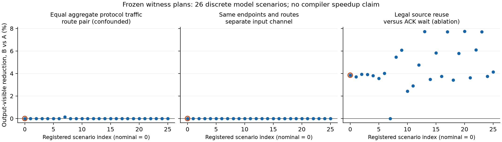

# R13 第一阶段：模型实现资格与有限小图探索

2026-09-08。**已实现并运行有限buffer/credit的DFG模型、独立tick回放及16B数据审计，完成576项名义全集和168次预选见证回放。模型内存在粗流量估价的选错计划现象；当前没有新编译算法或完整强P0比较，不通过M1编译器门，不启动M2完整模块性能实验。**

本轮使用公开Wormhole B0结构建立具名参考模型，没有要求或使用板卡。所有以下cycles是model cycles，不是芯片测量；36 tick精确表示一个cycle。原proposal、R1–R12实验和原始证据包保留。全文阅读/源码核查/实际执行范围见 [阅读覆盖](reading_coverage.md)。

## 1. 门判决

| 门 / 命题 | 本次实际状态 | 不能扩大的结论 |
|---|---|---|
| M0内部实现资格 | 功能、需求、服务守恒、手算例、独立tick/构造算术、逐16B值与复用审计、有限集成及本次744项小图回放已完成 | 只验证具名规则及执行实例，不认证厂商周期精度或任意输入活性。 |
| 限定跨工具参考 | 固定tt-npe源码/API及F投影已核查；当前WSL实际调用被拒，NPE没有执行 | 因此不无保留地签“整条M0链全部通过”，不沿用R12历史API成功补签。 |
| M1 / Hmodel | 576项共同合法集合中，最少payload hops或最少全协议flit-hops都会错过最优；有具名的模型估价边界证据 | 该小图、该离散集合和名义场景；不是新编译器收益。 |
| M1 / Hcompiler | 一个真实TETRA来源seed通过限定lowering；完整强P0组合、同预算搜索轨迹和P1均未完成 | 不把较保守seed当作强P0分母，不把exact枚举命名成新算法或现有启发式。**整门未通过。** |
| M2 | 未启动完整MLP性能模拟 | CPU完整MLP数值资格不等于六配置性能资格；没有3%完整模块或失配稳健性结论。 |

因此下一步仍在R13内：先补**共同计划/顺序能力与真实P0组合准入**，再判断是否有值得研究的编译搜索残差。没有理由因下面的3.68%粗估价regret直接开发新调度器、乱序硬件或进入完整MLP搜索。[具体接缝与证伪合同](p0_qualification_next.md)

## 2. 模型与预登记

主引擎 [event_machine.py](event_machine.py) 用事件堆推进；[model_builder.py](model_builder.py) 将完整request/response/ACK/通知/token、L1/DRAM访问、计算和控制动作映射为同一服务机。完整10×12物理torus保持所有转发节点，双NoC各自按固定维序路由。六组DRAM、每组两个channel的物理身份与endpoint alias分开；两NoC独立L1口仍共享16个bank。

主模型按flit进行cut-through服务，保留有限NIU/router队列、在途预留、共享池、credit延迟和逐hop VC锁。源读取、目标可见、完成观察、通知观察、消费者读取与接收token互不代用。代码/控制和微图RF有显式预算。未公开的服务效率、仲裁、dateline和NIU结构均标为研究假设。[参数](hardware_model.json)、[服务接口](machine_contract.md)、[修正和解释](model_refinements.md)

小图是四个活动tile、两条完整load→producer×2→peer→consumer+3→output链、两代、每payload 1KiB。每16B块值不同、跨代不同。六个payload span及控制块地址固定，统一复用与通知规则。它不是完整MLP或任意图编译器。

有限C为 **4种角色位置×3种输入placement×8个共同NoC三元组×3个首次chain1窗口×2种source guard=576**。固定tiling、单slot、输出位置和公共仲裁；没有一般per-transfer路由、任意事件窗口、buffer深度或资源次序搜索。名义全集exact仅指C内最优。

[原注册](preregistration.json)在功能资格和单个TETRA seed回放后、比较排名前写入。多进程IPC在零次F执行时被拒，故保留失败和原脚本，仅将执行组织改为串行，重新冻结 [实际执行注册](preregistration_serial.json)。C、参数和成本未改。名义全集576次、冻结见证6×26=156次，以及6×两种结构对照=12次，共744次F。两批来源哈希均稳定，名义枚举墙钟约357.68秒、见证约111.50秒；它们是实验运行费用，不能当作编译器算法时间。

## 3. 实际实现资格

| 验证 | 本轮实际结果 | 回执 |
|---|---|---|
| 完整数值 | H2560/I9216，M1/32/128；BF16乘数、规定FP32归约、SiLU/乘法、显式BF16 RNE cast、完整FP32 Y；独立实现的全部中间与输出逐位一致 | [数值](artifacts/numerical_qualification.json)、[说明](numerical_notes.md) |
| 源代数误差 | 固定生成样本相对FP64的L2分别0.162382%、0.165065%、0.165844%；通过事前阈值，未声明任务准确率或任意输入误差界 | 同上 |
| 原始需求回归 | 从2conv ONNX/affine/实际IR独立得到49152-bit halo；共享128-bit/cycle必要界384。显式full-copy合同的2048界另计；未证明实际512周期协议 | [需求](artifacts/demand_checks.json) |
| 通用状态机 | 17手算/状态单测；209个独立差分实例全部一致，其中115完成、94正确报告死锁；8个错误服务规则被检出 | [差分](artifacts/checker_differential.json)、[变异](artifacts/checker_rule_mutations.json) |
| 源参数到服务 | 两张完整微图与独立tick全轨迹一致；26参数点×两种bank布局的52张图通过独立构造/有理服务算术检查，后者没有被算成52次性能实验 | [构建器](artifacts/checker_builder.json) |
| 16B数据/epoch | 4张完整1KiB图，每图2576个内存完成事件、256个输出块；9个非法变异全部拒绝，含旧通知/token、块身份互换、提前复用和缺尾ACK | [数据审计](artifacts/trace_qualification.json) |
| 有限集成 | 7张完整微图、8KiB单packet正例、8KiB完整微图容量/地址预检拒绝，共9项符合预期；额外长路径descending实例tick差分一致 | [集成](artifacts/integration_qualification.json) |
| 本次全集/见证 | 576+168项全部终止且共同数据/生命周期审计通过；没有非法样本进入性能分母 | [名义紧凑分析](artifacts/micro_independent_analysis.json)；完整原始表留在本地复现目录 |
| 枚举后最优计划复核 | p0024的6120个操作与独立tick实现全部一致；数值、构造规则和链路账本通过，spec/trace哈希与枚举记录一致 | [最优项复核](artifacts/checker_optimum.json)，明确为事后验证，非预选见证 |

CPU三次GEMM实际支付M=1 padding到32的工作；cold BF16权重总量135MiB、Y为FP32、down前cast都进入数值/工作量合同。但这些内容尚未lower为完整MLP资源/性能计划。

独立tick与主DES的推进实现不同；独立构造检查不调用主路由/服务函数，数据审计不调用主 `audit_values`。它们共同验证的是已声明模型的一致实现。此前发现的group、deadlock终态、16B生效、timer倍率和控制读取问题已记录并保留失败回执，不隐去修正历史。[检查器设计](checker_design.md)

## 4. 有限集合最优与粗估价

下表所有候选使用同一个F、同输入/资源/地址/数值许可。完整原始表留在本地复现目录；仓库提交的是 [紧凑独立分析](artifacts/micro_independent_analysis.json) 与 [CSV](artifacts/micro_nominal.csv)。

| 计划 / 选择方法 | load/peer/output NoC | payload router byte-hops | 含NIU邻接的全协议flit-hops | 输出可见 | final完成观察 | quiescent |
|---|---|---:|---:|---:|---:|---:|
| p0000：三种粗估价按固定ID打平后的选中项 | 0/0/0 | 59,392 | 3,048 | 2336.7778 | 2456.7778 | 2472.7778 |
| p0024：C内exact之一 | 1/0/0 | 108,544 | 4,584 | **2253.7778** | **2373.7778** | **2389.7778** |

p0072与p0024并列最优，只将chain1输入改为同组另一channel，名义输出也为81136 ticks。当前表内的最优输出、完成观察和quiescent目标都由p0024达到；不是靠把尾部反馈排除才出现差距。

p0000比exact慢 **3.6827%**（分母为exact）；从p0000换成exact的时间减少为3.5519%（分母为p0000）。这两个百分比不能混用，也不能与完整模块M2阈值混用。p0024增加总流量但更快，说明仅压低总hops不保证最短完整时间；它同时改变load的正/反向路由与NoC接口竞争，尚没有把83-cycle差额单独分解成某一个资源原因。

粗估价并列必须保留：

| 估价器 | 最小估价并列项 | 这些项的F最优–最差（tick） | 判断 |
|---|---:|---:|---|
| payload router byte-hops | 24 | 82512–94780 | **所有**最小流量项都错过81136，非仅ID打平造成。 |
| 全协议flit-hops | 24 | 82512–94780 | 正确计入返回和控制流量后，聚合流量仍不足以选最优。 |
| 仅依赖/声明latency的DAG下界 | 8 | 81136–87492 | 包含exact；这里只能说明分辨力不足和打平策略regret，不能声称严格排序反转。 |

程序将第三项命名为 `zero_contention_critical_path`，但它忽略资源II和单packet自身flit串行化，不是实际无争用单流仿真。按lexical顺序枚举的48项前缀已含p0024，这只是已登记枚举覆盖轨迹，不是某个编译器在48次查询内找到最优的实验。

[独立全表复算](artifacts/micro_independent_analysis.json)另外重建笛卡尔C，核对576唯一ID、168个见证键、注册/来源哈希、保存的744项审计及终态，并独立算出相同exact和所有并列范围。两种traffic最小集合的最好项仍比exact慢1.695918%，这部分不能靠该集合内部打平消除；第三种估价则没有这个严格结论。该复算没有假称重新执行744份未保存的完整原始trace。

## 5. 预选完整协议见证及负结果

见证先按静态账本选，后读时序。40个packet、424个flit包含实际请求/响应、peer/output写、通知/token和ACK。W1按placement及十种事务角色的全协议总量分组，有46对共享router需求不同的候选；再要求每个packet也等hop则为0对。因此所选W1是等总量空间/路由对照，不能说是只改变链路争用。[独立方法审查](micro_design_audit.md)

| 预选对照 | 名义输出效果 | 26个冻结参数点 | 解释 |
|---|---|---|---|
| W1 p0384→p0528，等角色全协议flit-hops | 两者2367.5556 cycles，**持平** | 25点0；1点p0528改善0.142553% | 静态共享需求不同不必改变主终点；名义final/quiescent少9cycles仍单列。每flow路径长度有混杂。 |
| W2 p0000→p0048，只换第二条输入的物理channel | 两者2336.7778，**持平** | 输出、final、quiescent全部26点均持平 | channel预算确实从group0/ch0的8192 service ticks拆为ch0/ch1各4096；并行资源被正确识别，不代表关键路改善。 |
| W2补充p0096，输入换另一group | 2555.8889，较p0000慢 | 完整数据保留，未挑有利点 | 同时改变路径、NIU及与固定output channel的争用，不能只解释为“更多外存带宽”。 |
| W3 p0001→p0000，ACK等待改为合法source观察 | 2430.3333→2336.7778，减少**3.8495%** | 25点正向、1点0；范围0–7.7391% | 是强P0也有的合法提前释放能力；没有新算法归属，也不满足全域严格正向声明。 |

实际复用例：chain0旧peer最后源读26100 tick，付费观察26172，新load issue就在26172，旧peer ACK观察33240；chain1分别为22212、22284、22284、31560。两次新load均在已证明安全的source观察后、旧ACK前发行。接收/结果的跨代复用另由数据读取及真实token约束审核，没有拿ACK替代消费者读完。

另跑名义mono-bank与descending仲裁共12项：W1/W2主终点仍持平；W3改善分别约3.03%–3.49%（每项原数值见JSON）。这些是结构对照，不是随机样本或置信区间。**26点只覆盖预选见证的冻结计划**；没有在每个参数点重新搜索576项，也没有评估exact计划跨参数的稳健性。

图中圈出的第0点为名义场景。完整分布、三个终点及原参数逐项保留在 [分析回执](artifacts/micro_analysis.json)。零效果是本轮结果的一部分，不通过换见证或参数改成正结果。

## 6. 真实TETRA接入到哪一层

实际运行固定STREAM/TETRA、原scheduler和GSCIP。先导出官方2conv的真实访问/放置/slot/path/reuse/depth，再构造明确的R13 unary微图。具名目标适配为十二个物理channel各保留一个1GiB memory core，endpoint alias单列；双NoC480条有向router link按物理身份共享，未复制channel带宽，也未修改上游源码。

该目标输入固定p0000的空间与NoC，12个transfer各只有一个path choice、24个tensor各一个core choice；不是TETRA从576项中求得的空间最优。原三个目标阶段632/196608/24均OPTIMAL，626是其whole-transfer候选估价，不能用作F时间。slot顺序来自原scheduler在allocator前产生的启发式资源顺序，不是GSCIP联合优化出的全局顺序。

直接将global slot解释为全局完成屏障，与本次单source span地址映射的跨代复用形成环，实际deadlock并拒绝。另一个具名source-aware资源偏序lowering保留真实选择及2127条顺序义务，补齐正确控制与复用后，F输出3575.6667、完成观察3704.6667、quiescent3720.6667cycles；独立数据与构造审计通过。[准入回执](artifacts/tetra_lower_receipt.json)、[独立审查](tetra_lower_independent_audit.md)

这仍是**一个保守后端seed**：24个逻辑view映射14个物理span并受F的实际读取和复用保护；每个共享资源上的前transfer完成会限制后transfer的issue，强于单纯保留资源进入顺序。相同p0000参数标签不等于同一完整执行图；带额外偏序的seed尚不属于canonical C的已证明成员。不能用3575.67对2253.78宣称“击败强TETRA”。

尚缺SoMa-style生命周期/搬运顺序搜索、双缓冲与一般窗口的共同能力、原方法及组合的实际预算轨迹。修补这些接缝优先于提出新P1；若强P0吸收残差，应接受工程/负结果。[基线接入记录](baseline_intake.md)、[下一步资格合同](p0_qualification_next.md)

## 7. 可复现边界与保存

[README](README.md)列出运行命令与输出位置。主名义/见证/分析脚本拒绝覆盖已有结果；重跑必须给新输出路径，并保持注册来源哈希。CPU数值和其他资格脚本按其自身CLI运行，冻结结果存在时应在新目录/副本运行，避免覆盖历史。超过200KB的原始JSON/导出仍保留在本地复现目录，未随本次提交上传；紧凑结论和哈希清单已提交。

本轮没有修改固定依赖或R1–R12冻结实验；R12的52项hash检查通过，原证据包5项及两份历史活动文档快照也按原manifest核对。完整保留本轮失败、限定准入、紧凑数据和图，不提交虚拟环境、依赖克隆或临时pipeline缓存。当前没有执行本轮Git提交或推送。

当前足以成立的是一个可运行、可反证的参考模型和有限小图的估价边界。完整强编译器、可扩展搜索、完整MLP和实际芯片加速，均需要各自新增且通过的证据。
